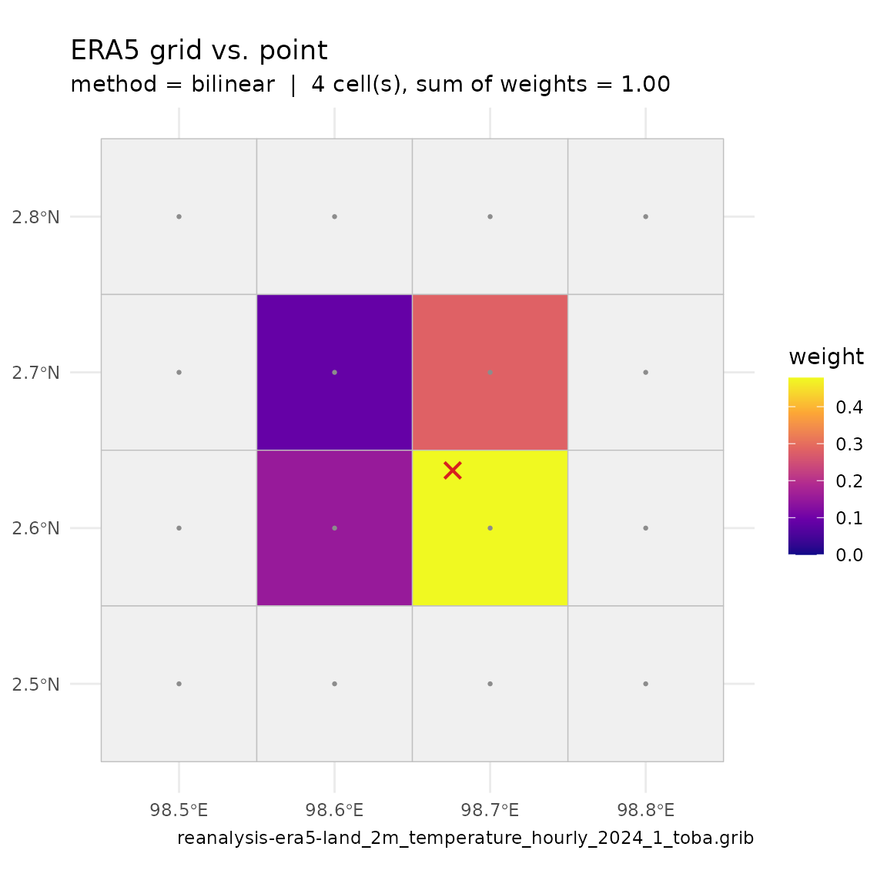

# Download ERA5 data

``` r

library(metscale)
```

`metscale`’s bias-correction and disaggregation tools operate on a
meteorology data frame. This vignette covers the three ways to *acquire*
ERA5 forcing, from lightest to heaviest. Whichever you use, the output
feeds into
[`standardise_met()`](http://limnotrack.com/metscale/reference/standardise_met.md),
[`fit_met_bias_correction()`](http://limnotrack.com/metscale/reference/fit_met_bias_correction.md)
and
[`disaggregate_met_to_hourly()`](http://limnotrack.com/metscale/reference/disaggregate_met_to_hourly.md).

All three functions need suggested packages that are **not** installed
with `metscale` by default:

``` r

install.packages(c("httr2", "jsonlite", "terra", "ecmwfr", "stars", "sf"))
```

## 1. Point time series from ISIMIP3a — `download_era5_isimip_point()`

The quickest route.
[`download_era5_isimip_point()`](http://limnotrack.com/metscale/reference/download_era5_isimip_point.md)
pulls daily ERA5 (20CRv3-ERA5, ISIMIP3a `obsclim`) from the [ISIMIP
repository API](https://files.isimip.org/api/v2) for any point on the
globe. No account or key is required. Coverage currently runs to 2021.

``` r

lon <- 98.67591   # Lake Toba, Indonesia
lat <- 2.637047
years <- 2015:2021
vars <- c("MET_tmpair", "MET_pprain")

met <- download_era5_isimip_point(lon, lat, years, vars)
#> ℹ Submitting job to ISIMIP server (4 files requested)
#> ✔ Job submitted in 2s | id=214bee8ef101706884cbc5691bc7f4b5fdac17d7 | status=finished
#> ✔ Server finished preparing 4 files in 0s
#> ℹ Downloading isimip-download-214bee8ef101706884cbc5691bc7f4b5fdac17d7.zip
#> ✔ Downloaded 0.6 MB in 2s (0.3 MB/s)
#> ℹ Extracting archive to /tmp/RtmpaMW7r8/isimip-download-214bee8ef101706884cbc5691bc7f4b5fdac17d7
#> ✔ Extracted 4 files in 0s
#> ℹ Reading 2 variables from NetCDF files
#> ℹ   tas: 2 files, 4018 records (0s)
#> ℹ   pr: 2 files, 4018 records (0s)
#> ✔ Read all variables in 1s
#> ✔ Done: 4018 daily records for 2 variables (total 5s)
summary(met)
#>       Date              MET_tmpair      MET_pprain    
#>  Min.   :2011-01-01   Min.   :19.02   Min.   : 0.000  
#>  1st Qu.:2013-10-01   1st Qu.:21.36   1st Qu.: 2.328  
#>  Median :2016-07-01   Median :21.84   Median : 5.551  
#>  Mean   :2016-07-01   Mean   :21.86   Mean   : 7.417  
#>  3rd Qu.:2019-04-01   3rd Qu.:22.35   3rd Qu.:10.339  
#>  Max.   :2021-12-31   Max.   :24.30   Max.   :76.598
```

Variable names may be given either as AEME `MET_*` names or as the
ERA5/CMIP short names (`tas`, `pr`, `sfcwind`, `rsds`, `ps`, `rlds`,
`hurs`). The result has a `Date` column plus one column per variable,
already in AEME names and units (degC, mm/day, …).

## 2. Gridded GRIB from the Copernicus Data Store — `download_era5_cds()`

For the full hourly ERA5 / ERA5-Land archive you need a free [ECMWF
account](https://www.ecmwf.int/user/login) or a free [Copernicus Data
Store (CDS)](https://cds.climate.copernicus.eu/user/register) account,
linked to your session with
[`ecmwfr::wf_set_key()`](https://rdrr.io/pkg/ecmwfr/man/wf_set_key.html).
See the [ecmwfr
documentation](https://bluegreen-labs.github.io/ecmwfr/#use).

``` r

ecmwfr::wf_set_key(key = Sys.getenv("ECMWF_KEY"),
                   user = Sys.getenv("ECMWF_USER"))
```

[`download_era5_cds()`](http://limnotrack.com/metscale/reference/download_era5_cds.md)
submits one CDS request per variable / year / month (batched, up to 20
at a time) and writes a GRIB file per request. Give it a point plus
`buffer`, or an `sf` polygon as `shape`.

File downloads can be slow, so this vignette uses a pre-downloaded GRIB
for demonstration. The `extdata` directory contains a single GRIB for
Lake Toba, Indonesia (2m temperature, January 2024).

``` r

year <- 2024
month <- 1
files <- download_era5_cds(
  lat = lat, lon = lon, year = year, month = month,
  variable = "2m_temperature", path = "data/test", site = "toba",
  user = Sys.getenv("ECMWF_USER")
)
```

``` r

files
#> [1] "/home/runner/work/_temp/Library/metscale/extdata/era5/reanalysis-era5-land_2m_temperature_hourly_2024_1_toba.grib"
```

Plot the downloaded GRIB with `plot_era5_grib()`:

Plot the point location on the downloaded grid with
[`plot_extract_grid()`](http://limnotrack.com/metscale/reference/plot_extract_grid.md):

``` r

path <- dirname(files)
plot_extract_grid(path = path, lon = lon, lat = lat, method = "bilinear")
```



Extract a point (or polygon-mean) time series from the downloaded GRIB
with
[`read_era5_grib_point()`](http://limnotrack.com/metscale/reference/read_era5_grib_point.md):

``` r

df <- read_era5_grib_point(file = files, lat = lat, lon = lon)
head(df)
#>              DateTime    value units     variable short_name
#> 1 2024-01-01 00:00:00 292.0308     C     2T_0-SFC         2T
#> 2 2024-01-01 01:00:00 292.5305     C 2T_0-SFC_2_1         2T
#> 3 2024-01-01 02:00:00 293.2504     C 2T_0-SFC_2_2         2T
#> 4 2024-01-01 03:00:00 294.5083     C 2T_0-SFC_2_3         2T
#> 5 2024-01-01 04:00:00 295.8975     C 2T_0-SFC_2_4         2T
#> 6 2024-01-01 05:00:00 297.0063     C 2T_0-SFC_2_5         2T
```

For a model-ready hourly frame (de-accumulated fluxes, standard units, a
time-zone shift) point
[`extract_era5_hourly_met()`](http://limnotrack.com/metscale/reference/extract_era5_hourly_met.md)
at the download directory instead. It picks the reader from each file’s
extension, so the GRIB written above is read directly; the default
`pattern` (`"{variable}"`) already matches
[`download_era5_cds()`](http://limnotrack.com/metscale/reference/download_era5_cds.md)
names, so nothing else is needed:

``` r

met <- extract_era5_hourly_met(
  path = path, lon = lon, lat = lat, years = year, variables = "2m_temperature"
  )
#>   2m_temperature: 1 file(s), 4 grid cell(s)
```

## 3. Aggregate downloaded ERA5 to daily — `convert_era5_netcdf()`

For a **daily** frame,
[`convert_era5_netcdf()`](http://limnotrack.com/metscale/reference/convert_era5_netcdf.md)
wraps the step above: it runs
[`extract_era5_hourly_met()`](http://limnotrack.com/metscale/reference/extract_era5_hourly_met.md)
over the files in `path` (netCDF or GRIB — the same file discovery,
spatial sampling, de-accumulation, unit conversion and time-zone shift)
and then aggregates to daily with
[`met_to_daily()`](http://limnotrack.com/metscale/reference/met_to_daily.md)
(rain and snow summed, everything else averaged). Extra `...` arguments
are forwarded to
[`extract_era5_hourly_met()`](http://limnotrack.com/metscale/reference/extract_era5_hourly_met.md).

``` r

met <- convert_era5_netcdf(
  path = path, lon = lon, lat = lat, years = year,
  variables = "2m_temperature", site = "toba", format = "AEME"
)
#>   2m_temperature: 1 file(s), 4 grid cell(s)
```

Unless `minmax = FALSE`, daily minimum and maximum air and dewpoint
temperature are added (`MET_airmin` / `MET_airmax` / `MET_dewmin` /
`MET_dewmax`).

`convert_era5_netcdf(format = "raw")` returns the ERA5 short names
(`t2m`, `d2m`, `ssrd`, `strd`, …) with a `datetime` column, which
[`standardise_met()`](http://limnotrack.com/metscale/reference/standardise_met.md)
recognises directly:

``` r

met_raw <- convert_era5_netcdf(path = path, lon = lon, lat = lat, years = year,
                               variables = "2m_temperature", format = "raw")
#>   2m_temperature: 1 file(s), 4 grid cell(s)
std <- standardise_met(met_raw)
#> date column: datetime -> Date
#> Warning in standardise_met(met_raw): 2 column(s) could not be matched and are
#> left unchanged: t2m_min, t2m_max
#> renamed: t2m -> MET_tmpair
#> Warning in standardise_met(met_raw): required variable(s) absent after
#> renaming: MET_radswd, MET_wndspd, MET_pprain
```

## Next steps

- [`standardise_met()`](http://limnotrack.com/metscale/reference/standardise_met.md)
  — column names, units, time zone, resampling.
- [`fit_met_bias_correction()`](http://limnotrack.com/metscale/reference/fit_met_bias_correction.md)
  /
  [`apply_met_bias_correction()`](http://limnotrack.com/metscale/reference/apply_met_bias_correction.md)
  — correct ERA5 against local observations.
- [`disaggregate_met_to_hourly()`](http://limnotrack.com/metscale/reference/disaggregate_met_to_hourly.md)
  — daily back to sub-daily.
- [`expand_met()`](http://limnotrack.com/metscale/reference/expand_met.md)
  — derive the remaining variables a lake model needs.
