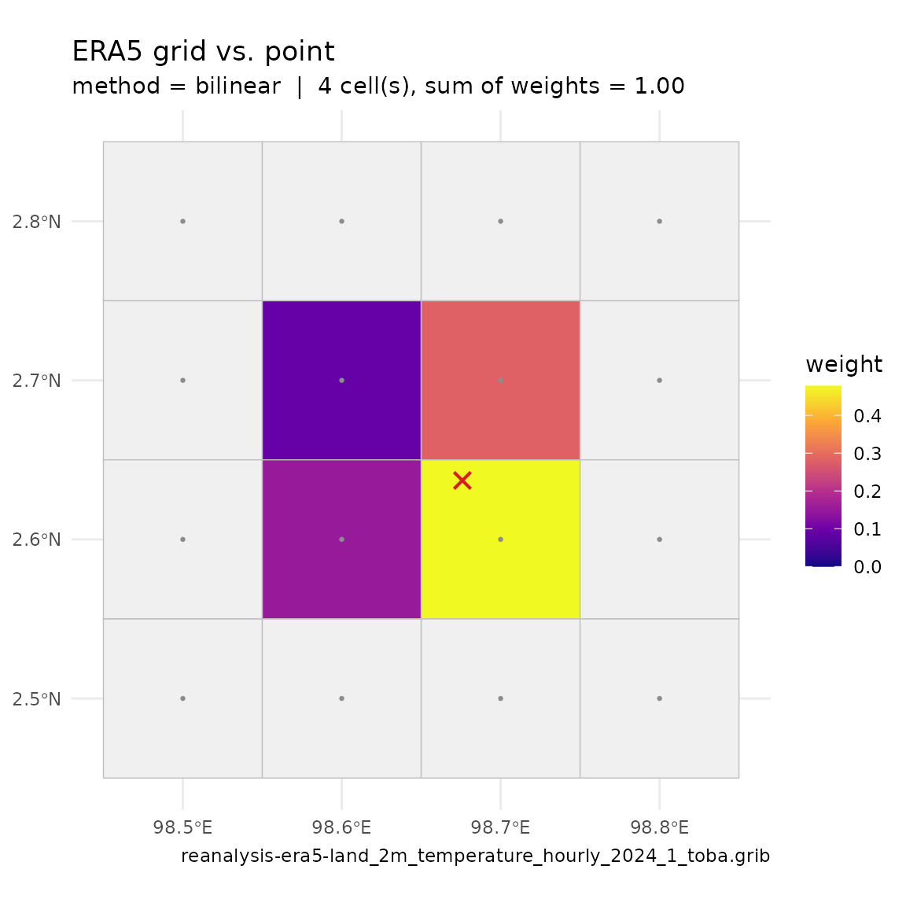

# Download ERA5 data

``` r

library(metscale)
```

`metscale`’s bias-correction and disaggregation tools operate on a
meteorology data frame. This vignette covers the three ways to *acquire*
ERA5 forcing, from lightest to heaviest. Whichever you use, the output
feeds into
[`standardise_met()`](http://limnotrack.com/metscale/reference/standardise_met.md),
[`fit_met_bias_correction()`](http://limnotrack.com/metscale/reference/fit_met_bias_correction.md)
and
[`disaggregate_met_to_hourly()`](http://limnotrack.com/metscale/reference/disaggregate_met_to_hourly.md).

All three functions need suggested packages that are **not** installed
with `metscale` by default:

``` r

install.packages(c("httr2", "jsonlite", "terra", "ecmwfr", "stars", "sf"))
```

## 1. Point time series from ISIMIP3a — `download_era5_isimip_point()`

The quickest route.
[`download_era5_isimip_point()`](http://limnotrack.com/metscale/reference/download_era5_isimip_point.md)
pulls daily ERA5 (20CRv3-ERA5, ISIMIP3a `obsclim`) from the [ISIMIP
repository API](https://files.isimip.org/api/v2) for any point on the
globe. No account or key is required. Coverage currently runs to 2021.

``` r

lon <- 98.67591   # Lake Toba, Indonesia
lat <- 2.637047
years <- 2015:2021
vars <- c("MET_tmpair", "MET_pprain")

met <- download_era5_isimip_point(lon, lat, years, vars)
#> ℹ Submitting job to ISIMIP server (4 files requested)
#> ✔ Job submitted in 2s | id=214bee8ef101706884cbc5691bc7f4b5fdac17d7 | status=queued
#> ℹ Server queued: / files prepared (4s elapsed)
#> ℹ Server queued: / files prepared (9s elapsed)
#> ℹ Server queued: / files prepared (13s elapsed)
#> ℹ Server queued: / files prepared (17s elapsed)
#> ℹ Server queued: / files prepared (22s elapsed)
#> ℹ Server queued: / files prepared (26s elapsed)
#> ℹ Server queued: / files prepared (31s elapsed)
#> ℹ Server queued: / files prepared (35s elapsed)
#> ℹ Server queued: / files prepared (39s elapsed)
#> ℹ Server queued: / files prepared (43s elapsed)
#> ℹ Server queued: / files prepared (48s elapsed)
#> ℹ Server queued: / files prepared (52s elapsed)
#> ℹ Server queued: / files prepared (56s elapsed)
#> ℹ Server queued: / files prepared (1.0 min elapsed)
#> ℹ Server queued: / files prepared (1.1 min elapsed)
#> ℹ Server queued: / files prepared (1.2 min elapsed)
#> ℹ Server queued: / files prepared (1.2 min elapsed)
#> ℹ Server queued: / files prepared (1.3 min elapsed)
#> ℹ Server queued: / files prepared (1.4 min elapsed)
#> ℹ Server queued: / files prepared (1.4 min elapsed)
#> ℹ Server queued: / files prepared (1.5 min elapsed)
#> ℹ Server queued: / files prepared (1.6 min elapsed)
#> ℹ Server queued: / files prepared (1.7 min elapsed)
#> ℹ Server queued: / files prepared (1.7 min elapsed)
#> ℹ Server queued: / files prepared (1.8 min elapsed)
#> ℹ Server queued: / files prepared (1.9 min elapsed)
#> ℹ Server queued: / files prepared (2.0 min elapsed)
#> ℹ Server queued: / files prepared (2.1 min elapsed)
#> ℹ Server queued: / files prepared (2.1 min elapsed)
#> ℹ Server queued: / files prepared (2.2 min elapsed)
#> ℹ Server queued: / files prepared (2.3 min elapsed)
#> ℹ Server queued: / files prepared (2.3 min elapsed)
#> ℹ Server queued: / files prepared (2.4 min elapsed)
#> ℹ Server queued: / files prepared (2.5 min elapsed)
#> ℹ Server queued: / files prepared (2.5 min elapsed)
#> ℹ Server queued: / files prepared (2.6 min elapsed)
#> ℹ Server queued: / files prepared (2.7 min elapsed)
#> ℹ Server queued: / files prepared (2.8 min elapsed)
#> ℹ Server queued: / files prepared (2.8 min elapsed)
#> ℹ Server queued: / files prepared (2.9 min elapsed)
#> ℹ Server queued: / files prepared (3.0 min elapsed)
#> ℹ Server queued: / files prepared (3.0 min elapsed)
#> ℹ Server queued: / files prepared (3.1 min elapsed)
#> ℹ Server queued: / files prepared (3.2 min elapsed)
#> ℹ Server queued: / files prepared (3.3 min elapsed)
#> ℹ Server queued: / files prepared (3.3 min elapsed)
#> ℹ Server queued: / files prepared (3.4 min elapsed)
#> ℹ Server queued: / files prepared (3.5 min elapsed)
#> ℹ Server queued: / files prepared (3.5 min elapsed)
#> ℹ Server queued: / files prepared (3.6 min elapsed)
#> ℹ Server queued: / files prepared (3.7 min elapsed)
#> ℹ Server queued: / files prepared (3.8 min elapsed)
#> ℹ Server queued: / files prepared (3.8 min elapsed)
#> ℹ Server queued: / files prepared (3.9 min elapsed)
#> ℹ Server queued: / files prepared (4.0 min elapsed)
#> ℹ Server queued: / files prepared (4.0 min elapsed)
#> ℹ Server queued: / files prepared (4.1 min elapsed)
#> ℹ Server queued: / files prepared (4.2 min elapsed)
#> ℹ Server queued: / files prepared (4.3 min elapsed)
#> ℹ Server queued: / files prepared (4.3 min elapsed)
#> ℹ Server queued: / files prepared (4.4 min elapsed)
#> ℹ Server queued: / files prepared (4.5 min elapsed)
#> ℹ Server queued: / files prepared (4.5 min elapsed)
#> ℹ Server queued: / files prepared (4.6 min elapsed)
#> ℹ Server queued: / files prepared (4.7 min elapsed)
#> ℹ Server queued: / files prepared (4.8 min elapsed)
#> ℹ Server queued: / files prepared (4.8 min elapsed)
#> ℹ Server queued: / files prepared (4.9 min elapsed)
#> ℹ Server queued: / files prepared (5.0 min elapsed)
#> ℹ Server queued: / files prepared (5.0 min elapsed)
#> ℹ Server queued: / files prepared (5.1 min elapsed)
#> ℹ Server queued: / files prepared (5.2 min elapsed)
#> ℹ Server queued: / files prepared (5.2 min elapsed)
#> ℹ Server queued: / files prepared (5.3 min elapsed)
#> ℹ Server queued: / files prepared (5.4 min elapsed)
#> ℹ Server queued: / files prepared (5.5 min elapsed)
#> ℹ Server queued: / files prepared (5.6 min elapsed)
#> ℹ Server queued: / files prepared (5.7 min elapsed)
#> ℹ Server queued: / files prepared (5.7 min elapsed)
#> ℹ Server queued: / files prepared (5.8 min elapsed)
#> ℹ Server queued: / files prepared (5.9 min elapsed)
#> ℹ Server queued: / files prepared (6.0 min elapsed)
#> ℹ Server queued: / files prepared (6.0 min elapsed)
#> ℹ Server queued: / files prepared (6.1 min elapsed)
#> ℹ Server queued: / files prepared (6.2 min elapsed)
#> ℹ Server queued: / files prepared (6.3 min elapsed)
#> ℹ Server queued: / files prepared (6.3 min elapsed)
#> ℹ Server queued: / files prepared (6.4 min elapsed)
#> ℹ Server queued: / files prepared (6.5 min elapsed)
#> ℹ Server queued: / files prepared (6.6 min elapsed)
#> ℹ Server queued: / files prepared (6.6 min elapsed)
#> ℹ Server queued: / files prepared (6.7 min elapsed)
#> ℹ Server queued: / files prepared (6.8 min elapsed)
#> ℹ Server queued: / files prepared (6.9 min elapsed)
#> ℹ Server queued: / files prepared (6.9 min elapsed)
#> ℹ Server queued: / files prepared (7.0 min elapsed)
#> ℹ Server queued: / files prepared (7.1 min elapsed)
#> ℹ Server queued: / files prepared (7.1 min elapsed)
#> ℹ Server queued: / files prepared (7.2 min elapsed)
#> ℹ Server queued: / files prepared (7.3 min elapsed)
#> ℹ Server queued: / files prepared (7.4 min elapsed)
#> ℹ Server queued: / files prepared (7.4 min elapsed)
#> ℹ Server queued: / files prepared (7.5 min elapsed)
#> ℹ Server queued: / files prepared (7.6 min elapsed)
#> ℹ Server queued: / files prepared (7.7 min elapsed)
#> ℹ Server queued: / files prepared (7.7 min elapsed)
#> ℹ Server queued: / files prepared (7.8 min elapsed)
#> ℹ Server queued: / files prepared (7.9 min elapsed)
#> ℹ Server queued: / files prepared (7.9 min elapsed)
#> ℹ Server queued: / files prepared (8.0 min elapsed)
#> ℹ Server queued: / files prepared (8.1 min elapsed)
#> ℹ Server queued: / files prepared (8.1 min elapsed)
#> ℹ Server queued: / files prepared (8.2 min elapsed)
#> ℹ Server queued: / files prepared (8.3 min elapsed)
#> ℹ Server queued: / files prepared (8.3 min elapsed)
#> ℹ Server queued: / files prepared (8.4 min elapsed)
#> ℹ Server queued: / files prepared (8.5 min elapsed)
#> ℹ Server queued: / files prepared (8.6 min elapsed)
#> ℹ Server queued: / files prepared (8.6 min elapsed)
#> ℹ Server queued: / files prepared (8.7 min elapsed)
#> ℹ Server queued: / files prepared (8.8 min elapsed)
#> ℹ Server queued: / files prepared (8.9 min elapsed)
#> ℹ Server queued: / files prepared (8.9 min elapsed)
#> ℹ Server queued: / files prepared (9.0 min elapsed)
#> ℹ Server queued: / files prepared (9.1 min elapsed)
#> ℹ Server queued: / files prepared (9.1 min elapsed)
#> ℹ Server queued: / files prepared (9.2 min elapsed)
#> ℹ Server queued: / files prepared (9.3 min elapsed)
#> ℹ Server queued: / files prepared (9.4 min elapsed)
#> ℹ Server queued: / files prepared (9.4 min elapsed)
#> ℹ Server queued: / files prepared (9.5 min elapsed)
#> ℹ Server queued: / files prepared (9.6 min elapsed)
#> ℹ Server queued: / files prepared (9.6 min elapsed)
#> ℹ Server queued: / files prepared (9.7 min elapsed)
#> ℹ Server queued: / files prepared (9.8 min elapsed)
#> ℹ Server queued: / files prepared (9.9 min elapsed)
#> ℹ Server queued: / files prepared (9.9 min elapsed)
#> ℹ Server queued: / files prepared (10.0 min elapsed)
#> ℹ Server queued: / files prepared (10.1 min elapsed)
#> ℹ Server queued: / files prepared (10.1 min elapsed)
#> ℹ Server queued: / files prepared (10.2 min elapsed)
#> ℹ Server queued: / files prepared (10.3 min elapsed)
#> ℹ Server queued: / files prepared (10.4 min elapsed)
#> ℹ Server queued: / files prepared (10.4 min elapsed)
#> ℹ Server queued: / files prepared (10.5 min elapsed)
#> ℹ Server queued: / files prepared (10.6 min elapsed)
#> ℹ Server queued: / files prepared (10.6 min elapsed)
#> ℹ Server queued: / files prepared (10.7 min elapsed)
#> ℹ Server queued: / files prepared (10.8 min elapsed)
#> ℹ Server queued: / files prepared (10.9 min elapsed)
#> ℹ Server queued: / files prepared (10.9 min elapsed)
#> ℹ Server queued: / files prepared (11.0 min elapsed)
#> ℹ Server queued: / files prepared (11.1 min elapsed)
#> ℹ Server queued: / files prepared (11.1 min elapsed)
#> ℹ Server queued: / files prepared (11.2 min elapsed)
#> ℹ Server queued: / files prepared (11.3 min elapsed)
#> ℹ Server queued: / files prepared (11.4 min elapsed)
#> ℹ Server queued: / files prepared (11.5 min elapsed)
#> ℹ Server queued: / files prepared (11.6 min elapsed)
#> ℹ Server queued: / files prepared (11.6 min elapsed)
#> ℹ Server queued: / files prepared (11.7 min elapsed)
#> ℹ Server queued: / files prepared (11.8 min elapsed)
#> ℹ Server queued: / files prepared (11.9 min elapsed)
#> ℹ Server queued: / files prepared (11.9 min elapsed)
#> ℹ Server queued: / files prepared (12.0 min elapsed)
#> ℹ Server queued: / files prepared (12.1 min elapsed)
#> ℹ Server queued: / files prepared (12.1 min elapsed)
#> ℹ Server queued: / files prepared (12.2 min elapsed)
#> ℹ Server queued: / files prepared (12.3 min elapsed)
#> ℹ Server queued: / files prepared (12.4 min elapsed)
#> ℹ Server queued: / files prepared (12.4 min elapsed)
#> ℹ Server queued: / files prepared (12.5 min elapsed)
#> ℹ Server queued: / files prepared (12.6 min elapsed)
#> ℹ Server queued: / files prepared (12.6 min elapsed)
#> ℹ Server queued: / files prepared (12.7 min elapsed)
#> ℹ Server queued: / files prepared (12.8 min elapsed)
#> ℹ Server queued: / files prepared (12.9 min elapsed)
#> ℹ Server queued: / files prepared (12.9 min elapsed)
#> ℹ Server queued: / files prepared (13.0 min elapsed)
#> ℹ Server queued: / files prepared (13.1 min elapsed)
#> ℹ Server queued: / files prepared (13.2 min elapsed)
#> ℹ Server queued: / files prepared (13.2 min elapsed)
#> ℹ Server queued: / files prepared (13.3 min elapsed)
#> ℹ Server queued: / files prepared (13.4 min elapsed)
#> ℹ Server queued: / files prepared (13.5 min elapsed)
#> ℹ Server queued: / files prepared (13.5 min elapsed)
#> ℹ Server queued: / files prepared (13.6 min elapsed)
#> ℹ Server queued: / files prepared (13.7 min elapsed)
#> ℹ Server queued: / files prepared (13.7 min elapsed)
#> ℹ Server queued: / files prepared (13.8 min elapsed)
#> ℹ Server queued: / files prepared (13.9 min elapsed)
#> ℹ Server queued: / files prepared (14.0 min elapsed)
#> ℹ Server queued: / files prepared (14.0 min elapsed)
#> ℹ Server queued: / files prepared (14.1 min elapsed)
#> ℹ Server queued: / files prepared (14.2 min elapsed)
#> ℹ Server queued: / files prepared (14.3 min elapsed)
#> ℹ Server queued: / files prepared (14.3 min elapsed)
#> ℹ Server queued: / files prepared (14.4 min elapsed)
#> ℹ Server queued: / files prepared (14.5 min elapsed)
#> ℹ Server queued: / files prepared (14.6 min elapsed)
#> ℹ Server queued: / files prepared (14.6 min elapsed)
#> ℹ Server queued: / files prepared (14.7 min elapsed)
#> ℹ Server queued: / files prepared (14.8 min elapsed)
#> ℹ Server queued: / files prepared (14.9 min elapsed)
#> ℹ Server queued: / files prepared (14.9 min elapsed)
#> ℹ Server queued: / files prepared (15.0 min elapsed)
#> ℹ Server queued: / files prepared (15.1 min elapsed)
#> ℹ Server queued: / files prepared (15.1 min elapsed)
#> ℹ Server queued: / files prepared (15.2 min elapsed)
#> ℹ Server queued: / files prepared (15.3 min elapsed)
#> ℹ Server queued: / files prepared (15.4 min elapsed)
#> ℹ Server queued: / files prepared (15.4 min elapsed)
#> ℹ Server queued: / files prepared (15.5 min elapsed)
#> ℹ Server queued: / files prepared (15.6 min elapsed)
#> ℹ Server queued: / files prepared (15.6 min elapsed)
#> ℹ Server queued: / files prepared (15.7 min elapsed)
#> ℹ Server queued: / files prepared (15.8 min elapsed)
#> ℹ Server queued: / files prepared (15.8 min elapsed)
#> ℹ Server queued: / files prepared (15.9 min elapsed)
#> ℹ Server queued: / files prepared (16.0 min elapsed)
#> ℹ Server queued: / files prepared (16.1 min elapsed)
#> ℹ Server queued: / files prepared (16.1 min elapsed)
#> ℹ Server queued: / files prepared (16.2 min elapsed)
#> ℹ Server queued: / files prepared (16.3 min elapsed)
#> ℹ Server queued: / files prepared (16.3 min elapsed)
#> ℹ Server queued: / files prepared (16.4 min elapsed)
#> ℹ Server queued: / files prepared (16.5 min elapsed)
#> ℹ Server queued: / files prepared (16.5 min elapsed)
#> ℹ Server queued: / files prepared (16.6 min elapsed)
#> ℹ Server queued: / files prepared (16.7 min elapsed)
#> ℹ Server queued: / files prepared (16.8 min elapsed)
#> ℹ Server queued: / files prepared (16.8 min elapsed)
#> ℹ Server queued: / files prepared (16.9 min elapsed)
#> ℹ Server queued: / files prepared (17.0 min elapsed)
#> ℹ Server queued: / files prepared (17.1 min elapsed)
#> ℹ Server queued: / files prepared (17.1 min elapsed)
#> ℹ Server queued: / files prepared (17.2 min elapsed)
#> ℹ Server queued: / files prepared (17.3 min elapsed)
#> ℹ Server queued: / files prepared (17.3 min elapsed)
#> ℹ Server queued: / files prepared (17.4 min elapsed)
#> ℹ Server queued: / files prepared (17.5 min elapsed)
#> ℹ Server queued: / files prepared (17.5 min elapsed)
#> ℹ Server queued: / files prepared (17.6 min elapsed)
#> ℹ Server queued: / files prepared (17.7 min elapsed)
#> ℹ Server queued: / files prepared (17.8 min elapsed)
#> ℹ Server queued: / files prepared (17.8 min elapsed)
#> ℹ Server queued: / files prepared (17.9 min elapsed)
#> ℹ Server queued: / files prepared (18.0 min elapsed)
#> ℹ Server queued: / files prepared (18.0 min elapsed)
#> ℹ Server queued: / files prepared (18.1 min elapsed)
#> ℹ Server queued: / files prepared (18.2 min elapsed)
#> ℹ Server queued: / files prepared (18.2 min elapsed)
#> ℹ Server queued: / files prepared (18.3 min elapsed)
#> ℹ Server queued: / files prepared (18.4 min elapsed)
#> ℹ Server queued: / files prepared (18.5 min elapsed)
#> ℹ Server queued: / files prepared (18.5 min elapsed)
#> ℹ Server queued: / files prepared (18.6 min elapsed)
#> ℹ Server queued: / files prepared (18.7 min elapsed)
#> ℹ Server queued: / files prepared (18.7 min elapsed)
#> ℹ Server queued: / files prepared (18.8 min elapsed)
#> ℹ Server queued: / files prepared (18.9 min elapsed)
#> ℹ Server queued: / files prepared (18.9 min elapsed)
#> ℹ Server queued: / files prepared (19.0 min elapsed)
#> ℹ Server queued: / files prepared (19.1 min elapsed)
#> ℹ Server queued: / files prepared (19.2 min elapsed)
#> ℹ Server queued: / files prepared (19.2 min elapsed)
#> ℹ Server queued: / files prepared (19.3 min elapsed)
#> ℹ Server queued: / files prepared (19.4 min elapsed)
#> ℹ Server queued: / files prepared (19.4 min elapsed)
#> ℹ Server queued: / files prepared (19.5 min elapsed)
#> ℹ Server queued: / files prepared (19.6 min elapsed)
#> ℹ Server queued: / files prepared (19.7 min elapsed)
#> ℹ Server queued: / files prepared (19.7 min elapsed)
#> ℹ Server queued: / files prepared (19.8 min elapsed)
#> ℹ Server queued: / files prepared (19.9 min elapsed)
#> ℹ Server queued: / files prepared (19.9 min elapsed)
#> ℹ Server queued: / files prepared (20.0 min elapsed)
#> ℹ Server queued: / files prepared (20.1 min elapsed)
#> ℹ Server queued: / files prepared (20.1 min elapsed)
#> ℹ Server queued: / files prepared (20.2 min elapsed)
#> ℹ Server queued: / files prepared (20.3 min elapsed)
#> ℹ Server queued: / files prepared (20.3 min elapsed)
#> ℹ Server queued: / files prepared (20.4 min elapsed)
#> ℹ Server queued: / files prepared (20.5 min elapsed)
#> ℹ Server queued: / files prepared (20.6 min elapsed)
#> ℹ Server queued: / files prepared (20.6 min elapsed)
#> ℹ Server queued: / files prepared (20.7 min elapsed)
#> ℹ Server queued: / files prepared (20.8 min elapsed)
#> ℹ Server queued: / files prepared (20.8 min elapsed)
#> ℹ Server queued: / files prepared (20.9 min elapsed)
#> ℹ Server queued: / files prepared (21.0 min elapsed)
#> ℹ Server queued: / files prepared (21.1 min elapsed)
#> ℹ Server queued: / files prepared (21.1 min elapsed)
#> ℹ Server queued: / files prepared (21.2 min elapsed)
#> ℹ Server queued: / files prepared (21.3 min elapsed)
#> ℹ Server queued: / files prepared (21.3 min elapsed)
#> ℹ Server queued: / files prepared (21.4 min elapsed)
#> ℹ Server queued: / files prepared (21.5 min elapsed)
#> ℹ Server queued: / files prepared (21.5 min elapsed)
#> ℹ Server queued: / files prepared (21.6 min elapsed)
#> ℹ Server queued: / files prepared (21.7 min elapsed)
#> ℹ Server queued: / files prepared (21.8 min elapsed)
#> ℹ Server queued: / files prepared (21.8 min elapsed)
#> ℹ Server queued: / files prepared (21.9 min elapsed)
#> ℹ Server queued: / files prepared (22.0 min elapsed)
#> ℹ Server queued: / files prepared (22.1 min elapsed)
#> ℹ Server queued: / files prepared (22.1 min elapsed)
#> ℹ Server queued: / files prepared (22.2 min elapsed)
#> ℹ Server queued: / files prepared (22.3 min elapsed)
#> ℹ Server queued: / files prepared (22.3 min elapsed)
#> ℹ Server queued: / files prepared (22.4 min elapsed)
#> ℹ Server queued: / files prepared (22.5 min elapsed)
#> ℹ Server queued: / files prepared (22.6 min elapsed)
#> ℹ Server queued: / files prepared (22.7 min elapsed)
#> ℹ Server queued: / files prepared (22.7 min elapsed)
#> ℹ Server queued: / files prepared (22.8 min elapsed)
#> ℹ Server queued: / files prepared (22.9 min elapsed)
#> ℹ Server queued: / files prepared (23.0 min elapsed)
#> ℹ Server queued: / files prepared (23.0 min elapsed)
#> ℹ Server queued: / files prepared (23.1 min elapsed)
#> ℹ Server queued: / files prepared (23.2 min elapsed)
#> ℹ Server queued: / files prepared (23.2 min elapsed)
#> ℹ Server queued: / files prepared (23.3 min elapsed)
#> ℹ Server queued: / files prepared (23.4 min elapsed)
#> ℹ Server queued: / files prepared (23.5 min elapsed)
#> ℹ Server queued: / files prepared (23.5 min elapsed)
#> ℹ Server queued: / files prepared (23.6 min elapsed)
#> ℹ Server queued: / files prepared (23.7 min elapsed)
#> ℹ Server queued: / files prepared (23.7 min elapsed)
#> ℹ Server queued: / files prepared (23.8 min elapsed)
#> ℹ Server queued: / files prepared (23.9 min elapsed)
#> ℹ Server queued: / files prepared (23.9 min elapsed)
#> ℹ Server queued: / files prepared (24.0 min elapsed)
#> ℹ Server queued: / files prepared (24.1 min elapsed)
#> ℹ Server queued: / files prepared (24.1 min elapsed)
#> ℹ Server queued: / files prepared (24.2 min elapsed)
#> ℹ Server queued: / files prepared (24.3 min elapsed)
#> ℹ Server queued: / files prepared (24.4 min elapsed)
#> ℹ Server queued: / files prepared (24.4 min elapsed)
#> ℹ Server queued: / files prepared (24.5 min elapsed)
#> ℹ Server queued: / files prepared (24.6 min elapsed)
#> ℹ Server queued: / files prepared (24.7 min elapsed)
#> ℹ Server queued: / files prepared (24.7 min elapsed)
#> ℹ Server queued: / files prepared (24.8 min elapsed)
#> ℹ Server queued: / files prepared (24.9 min elapsed)
#> ℹ Server queued: / files prepared (24.9 min elapsed)
#> ℹ Server queued: / files prepared (25.0 min elapsed)
#> ℹ Server queued: / files prepared (25.1 min elapsed)
#> ℹ Server queued: / files prepared (25.2 min elapsed)
#> ℹ Server queued: / files prepared (25.2 min elapsed)
#> ℹ Server queued: / files prepared (25.3 min elapsed)
#> ℹ Server queued: / files prepared (25.4 min elapsed)
#> ℹ Server queued: / files prepared (25.5 min elapsed)
#> ℹ Server queued: / files prepared (25.5 min elapsed)
#> ℹ Server queued: / files prepared (25.6 min elapsed)
#> ℹ Server queued: / files prepared (25.7 min elapsed)
#> ℹ Server queued: / files prepared (25.7 min elapsed)
#> ℹ Server queued: / files prepared (25.8 min elapsed)
#> ℹ Server queued: / files prepared (25.9 min elapsed)
#> ℹ Server queued: / files prepared (26.0 min elapsed)
#> ℹ Server queued: / files prepared (26.0 min elapsed)
#> ℹ Server queued: / files prepared (26.1 min elapsed)
#> ℹ Server queued: / files prepared (26.2 min elapsed)
#> ℹ Server queued: / files prepared (26.2 min elapsed)
#> ℹ Server queued: / files prepared (26.3 min elapsed)
#> ℹ Server queued: / files prepared (26.4 min elapsed)
#> ℹ Server queued: / files prepared (26.5 min elapsed)
#> ℹ Server queued: / files prepared (26.5 min elapsed)
#> ℹ Server queued: / files prepared (26.6 min elapsed)
#> ℹ Server queued: / files prepared (26.7 min elapsed)
#> ℹ Server queued: / files prepared (26.7 min elapsed)
#> ℹ Server queued: / files prepared (26.8 min elapsed)
#> ℹ Server queued: / files prepared (26.9 min elapsed)
#> ℹ Server queued: / files prepared (27.0 min elapsed)
#> ℹ Server queued: / files prepared (27.0 min elapsed)
#> ℹ Server queued: / files prepared (27.1 min elapsed)
#> ℹ Server queued: / files prepared (27.2 min elapsed)
#> ℹ Server queued: / files prepared (27.2 min elapsed)
#> ℹ Server queued: / files prepared (27.3 min elapsed)
#> ℹ Server queued: / files prepared (27.4 min elapsed)
#> ℹ Server queued: / files prepared (27.5 min elapsed)
#> ℹ Server queued: / files prepared (27.5 min elapsed)
#> ℹ Server queued: / files prepared (27.6 min elapsed)
#> ℹ Server queued: / files prepared (27.7 min elapsed)
#> ℹ Server queued: / files prepared (27.7 min elapsed)
#> ℹ Server queued: / files prepared (27.8 min elapsed)
#> ℹ Server queued: / files prepared (27.9 min elapsed)
#> ℹ Server queued: / files prepared (28.0 min elapsed)
#> ℹ Server queued: / files prepared (28.0 min elapsed)
#> ℹ Server queued: / files prepared (28.1 min elapsed)
#> ℹ Server queued: / files prepared (28.2 min elapsed)
#> ℹ Server queued: / files prepared (28.3 min elapsed)
#> ℹ Server queued: / files prepared (28.3 min elapsed)
#> ℹ Server queued: / files prepared (28.4 min elapsed)
#> ℹ Server queued: / files prepared (28.5 min elapsed)
#> ℹ Server queued: / files prepared (28.6 min elapsed)
#> ℹ Server queued: / files prepared (28.6 min elapsed)
#> ℹ Server queued: / files prepared (28.7 min elapsed)
#> ℹ Server queued: / files prepared (28.8 min elapsed)
#> ℹ Server queued: / files prepared (28.9 min elapsed)
#> ℹ Server queued: / files prepared (29.0 min elapsed)
#> ℹ Server queued: / files prepared (29.0 min elapsed)
#> ℹ Server queued: / files prepared (29.1 min elapsed)
#> ℹ Server queued: / files prepared (29.2 min elapsed)
#> ℹ Server queued: / files prepared (29.2 min elapsed)
#> ℹ Server queued: / files prepared (29.3 min elapsed)
#> ℹ Server queued: / files prepared (29.4 min elapsed)
#> ℹ Server queued: / files prepared (29.4 min elapsed)
#> ℹ Server queued: / files prepared (29.5 min elapsed)
#> ℹ Server queued: / files prepared (29.6 min elapsed)
#> ℹ Server queued: / files prepared (29.6 min elapsed)
#> ℹ Server queued: / files prepared (29.7 min elapsed)
#> ℹ Server queued: / files prepared (29.8 min elapsed)
#> ℹ Server queued: / files prepared (29.9 min elapsed)
#> ℹ Server queued: / files prepared (30.0 min elapsed)
#> ℹ Server queued: / files prepared (30.0 min elapsed)
#> ℹ Server queued: / files prepared (30.1 min elapsed)
#> ℹ Server queued: / files prepared (30.2 min elapsed)
#> ℹ Server queued: / files prepared (30.2 min elapsed)
#> ℹ Server queued: / files prepared (30.3 min elapsed)
#> ℹ Server queued: / files prepared (30.4 min elapsed)
#> ℹ Server queued: / files prepared (30.5 min elapsed)
#> ℹ Server queued: / files prepared (30.5 min elapsed)
#> ℹ Server queued: / files prepared (30.6 min elapsed)
#> ℹ Server queued: / files prepared (30.7 min elapsed)
#> ℹ Server queued: / files prepared (30.7 min elapsed)
#> ℹ Server queued: / files prepared (30.8 min elapsed)
#> ℹ Server queued: / files prepared (30.9 min elapsed)
#> ℹ Server queued: / files prepared (31.0 min elapsed)
#> ℹ Server queued: / files prepared (31.0 min elapsed)
#> ℹ Server queued: / files prepared (31.1 min elapsed)
#> ℹ Server queued: / files prepared (31.2 min elapsed)
#> ℹ Server queued: / files prepared (31.3 min elapsed)
#> ℹ Server queued: / files prepared (31.3 min elapsed)
#> ℹ Server queued: / files prepared (31.4 min elapsed)
#> ℹ Server queued: / files prepared (31.5 min elapsed)
#> ℹ Server queued: / files prepared (31.5 min elapsed)
#> ℹ Server queued: / files prepared (31.6 min elapsed)
#> ℹ Server queued: / files prepared (31.7 min elapsed)
#> ℹ Server queued: / files prepared (31.7 min elapsed)
#> ℹ Server queued: / files prepared (31.8 min elapsed)
#> ℹ Server queued: / files prepared (31.9 min elapsed)
#> ℹ Server queued: / files prepared (32.0 min elapsed)
#> ℹ Server queued: / files prepared (32.0 min elapsed)
#> ℹ Server queued: / files prepared (32.1 min elapsed)
#> ℹ Server queued: / files prepared (32.2 min elapsed)
#> ℹ Server queued: / files prepared (32.2 min elapsed)
#> ℹ Server queued: / files prepared (32.3 min elapsed)
#> ℹ Server queued: / files prepared (32.4 min elapsed)
#> ℹ Server queued: / files prepared (32.5 min elapsed)
#> ℹ Server queued: / files prepared (32.5 min elapsed)
#> ℹ Server queued: / files prepared (32.6 min elapsed)
#> ℹ Server queued: / files prepared (32.7 min elapsed)
#> ℹ Server queued: / files prepared (32.8 min elapsed)
#> ℹ Server queued: / files prepared (32.9 min elapsed)
#> ℹ Server queued: / files prepared (32.9 min elapsed)
#> ℹ Server queued: / files prepared (33.0 min elapsed)
#> ℹ Server queued: / files prepared (33.1 min elapsed)
#> ℹ Server queued: / files prepared (33.2 min elapsed)
#> ℹ Server queued: / files prepared (33.2 min elapsed)
#> ℹ Server queued: / files prepared (33.3 min elapsed)
#> ℹ Server queued: / files prepared (33.4 min elapsed)
#> ℹ Server queued: / files prepared (33.5 min elapsed)
#> ℹ Server queued: / files prepared (33.5 min elapsed)
#> ℹ Server queued: / files prepared (33.6 min elapsed)
#> ℹ Server queued: / files prepared (33.7 min elapsed)
#> ℹ Server queued: / files prepared (33.8 min elapsed)
#> ℹ Server queued: / files prepared (33.8 min elapsed)
#> ℹ Server queued: / files prepared (33.9 min elapsed)
#> ℹ Server queued: / files prepared (34.0 min elapsed)
#> ℹ Server queued: / files prepared (34.1 min elapsed)
#> ℹ Server queued: / files prepared (34.1 min elapsed)
#> ℹ Server queued: / files prepared (34.2 min elapsed)
#> ℹ Server queued: / files prepared (34.3 min elapsed)
#> ℹ Server queued: / files prepared (34.3 min elapsed)
#> ℹ Server queued: / files prepared (34.4 min elapsed)
#> ℹ Server queued: / files prepared (34.5 min elapsed)
#> ℹ Server queued: / files prepared (34.6 min elapsed)
#> ℹ Server queued: / files prepared (34.6 min elapsed)
#> ℹ Server queued: / files prepared (34.7 min elapsed)
#> ℹ Server queued: / files prepared (34.8 min elapsed)
#> ℹ Server queued: / files prepared (34.9 min elapsed)
#> ℹ Server queued: / files prepared (34.9 min elapsed)
#> ℹ Server queued: / files prepared (35.0 min elapsed)
#> ℹ Server queued: / files prepared (35.1 min elapsed)
#> ℹ Server queued: / files prepared (35.2 min elapsed)
#> ℹ Server queued: / files prepared (35.2 min elapsed)
#> ℹ Server queued: / files prepared (35.3 min elapsed)
#> ℹ Server queued: / files prepared (35.4 min elapsed)
#> ℹ Server queued: / files prepared (35.5 min elapsed)
#> ℹ Server queued: / files prepared (35.5 min elapsed)
#> ℹ Server queued: / files prepared (35.6 min elapsed)
#> ℹ Server queued: / files prepared (35.7 min elapsed)
#> ℹ Server queued: / files prepared (35.7 min elapsed)
#> ℹ Server queued: / files prepared (35.8 min elapsed)
#> ℹ Server queued: / files prepared (35.9 min elapsed)
#> ℹ Server queued: / files prepared (36.0 min elapsed)
#> ℹ Server queued: / files prepared (36.0 min elapsed)
#> ℹ Server queued: / files prepared (36.1 min elapsed)
#> ℹ Server queued: / files prepared (36.2 min elapsed)
#> ℹ Server queued: / files prepared (36.3 min elapsed)
#> ℹ Server queued: / files prepared (36.4 min elapsed)
#> ℹ Server queued: / files prepared (36.4 min elapsed)
#> ℹ Server queued: / files prepared (36.5 min elapsed)
#> ℹ Server queued: / files prepared (36.6 min elapsed)
#> ℹ Server queued: / files prepared (36.6 min elapsed)
#> ℹ Server queued: / files prepared (36.7 min elapsed)
#> ℹ Server queued: / files prepared (36.8 min elapsed)
#> ℹ Server queued: / files prepared (36.9 min elapsed)
#> ℹ Server queued: / files prepared (36.9 min elapsed)
#> ℹ Server queued: / files prepared (37.0 min elapsed)
#> ℹ Server queued: / files prepared (37.1 min elapsed)
#> ℹ Server queued: / files prepared (37.2 min elapsed)
#> ℹ Server queued: / files prepared (37.2 min elapsed)
#> ℹ Server queued: / files prepared (37.3 min elapsed)
#> ℹ Server queued: / files prepared (37.4 min elapsed)
#> ℹ Server queued: / files prepared (37.4 min elapsed)
#> ℹ Server queued: / files prepared (37.5 min elapsed)
#> ℹ Server queued: / files prepared (37.6 min elapsed)
#> ℹ Server queued: / files prepared (37.6 min elapsed)
#> ℹ Server queued: / files prepared (37.7 min elapsed)
#> ℹ Server queued: / files prepared (37.8 min elapsed)
#> ℹ Server queued: / files prepared (37.9 min elapsed)
#> ℹ Server queued: / files prepared (37.9 min elapsed)
#> ℹ Server queued: / files prepared (38.0 min elapsed)
#> ℹ Server queued: / files prepared (38.1 min elapsed)
#> ℹ Server queued: / files prepared (38.1 min elapsed)
#> ℹ Server queued: / files prepared (38.2 min elapsed)
#> ℹ Server queued: / files prepared (38.3 min elapsed)
#> ℹ Server queued: / files prepared (38.4 min elapsed)
#> ℹ Server queued: / files prepared (38.4 min elapsed)
#> ℹ Server queued: / files prepared (38.5 min elapsed)
#> ℹ Server queued: / files prepared (38.6 min elapsed)
#> ℹ Server queued: / files prepared (38.6 min elapsed)
#> ℹ Server queued: / files prepared (38.7 min elapsed)
#> ℹ Server queued: / files prepared (38.8 min elapsed)
#> ℹ Server queued: / files prepared (38.9 min elapsed)
#> ℹ Server queued: / files prepared (38.9 min elapsed)
#> ℹ Server queued: / files prepared (39.0 min elapsed)
#> ℹ Server queued: / files prepared (39.1 min elapsed)
#> ℹ Server queued: / files prepared (39.1 min elapsed)
#> ℹ Server queued: / files prepared (39.2 min elapsed)
#> ℹ Server queued: / files prepared (39.3 min elapsed)
#> ℹ Server queued: / files prepared (39.4 min elapsed)
#> ℹ Server queued: / files prepared (39.4 min elapsed)
#> ℹ Server queued: / files prepared (39.5 min elapsed)
#> ℹ Server queued: / files prepared (39.6 min elapsed)
#> ℹ Server queued: / files prepared (39.6 min elapsed)
#> ℹ Server queued: / files prepared (39.7 min elapsed)
#> ℹ Server queued: / files prepared (39.8 min elapsed)
#> ℹ Server queued: / files prepared (39.8 min elapsed)
#> ℹ Server queued: / files prepared (39.9 min elapsed)
#> ℹ Server queued: / files prepared (40.0 min elapsed)
#> ℹ Server queued: / files prepared (40.1 min elapsed)
#> ℹ Server queued: / files prepared (40.1 min elapsed)
#> ℹ Server queued: / files prepared (40.2 min elapsed)
#> ℹ Server queued: / files prepared (40.3 min elapsed)
#> ℹ Server queued: / files prepared (40.3 min elapsed)
#> ℹ Server queued: / files prepared (40.4 min elapsed)
#> ℹ Server queued: / files prepared (40.5 min elapsed)
#> ℹ Server queued: / files prepared (40.5 min elapsed)
#> ℹ Server queued: / files prepared (40.6 min elapsed)
#> ℹ Server queued: / files prepared (40.7 min elapsed)
#> ℹ Server queued: / files prepared (40.7 min elapsed)
#> ℹ Server queued: / files prepared (40.8 min elapsed)
#> ℹ Server queued: / files prepared (40.9 min elapsed)
#> ℹ Server queued: / files prepared (41.0 min elapsed)
#> ℹ Server queued: / files prepared (41.0 min elapsed)
#> ℹ Server queued: / files prepared (41.1 min elapsed)
#> ℹ Server queued: / files prepared (41.2 min elapsed)
#> ℹ Server queued: / files prepared (41.2 min elapsed)
#> ℹ Server queued: / files prepared (41.3 min elapsed)
#> ℹ Server queued: / files prepared (41.4 min elapsed)
#> ℹ Server queued: / files prepared (41.5 min elapsed)
#> ℹ Server queued: / files prepared (41.5 min elapsed)
#> ℹ Server queued: / files prepared (41.6 min elapsed)
#> ℹ Server queued: / files prepared (41.7 min elapsed)
#> ℹ Server queued: / files prepared (41.8 min elapsed)
#> ℹ Server queued: / files prepared (41.8 min elapsed)
#> ℹ Server queued: / files prepared (41.9 min elapsed)
#> ℹ Server queued: / files prepared (42.0 min elapsed)
#> ℹ Server queued: / files prepared (42.0 min elapsed)
#> ℹ Server queued: / files prepared (42.1 min elapsed)
#> ℹ Server queued: / files prepared (42.2 min elapsed)
#> ℹ Server queued: / files prepared (42.3 min elapsed)
#> ℹ Server queued: / files prepared (42.3 min elapsed)
#> ℹ Server queued: / files prepared (42.4 min elapsed)
#> ℹ Server queued: / files prepared (42.5 min elapsed)
#> ℹ Server queued: / files prepared (42.6 min elapsed)
#> ℹ Server queued: / files prepared (42.6 min elapsed)
#> ℹ Server queued: / files prepared (42.7 min elapsed)
#> ℹ Server queued: / files prepared (42.8 min elapsed)
#> ℹ Server queued: / files prepared (42.8 min elapsed)
#> ℹ Server queued: / files prepared (42.9 min elapsed)
#> ℹ Server queued: / files prepared (43.0 min elapsed)
#> ℹ Server queued: / files prepared (43.0 min elapsed)
#> ℹ Server queued: / files prepared (43.1 min elapsed)
#> ℹ Server queued: / files prepared (43.2 min elapsed)
#> ℹ Server queued: / files prepared (43.3 min elapsed)
#> ℹ Server queued: / files prepared (43.3 min elapsed)
#> ℹ Server queued: / files prepared (43.4 min elapsed)
#> ℹ Server queued: / files prepared (43.5 min elapsed)
#> ℹ Server queued: / files prepared (43.5 min elapsed)
#> ℹ Server queued: / files prepared (43.6 min elapsed)
#> ℹ Server queued: / files prepared (43.7 min elapsed)
#> ℹ Server queued: / files prepared (43.8 min elapsed)
#> ℹ Server queued: / files prepared (43.8 min elapsed)
#> ℹ Server queued: / files prepared (43.9 min elapsed)
#> ℹ Server queued: / files prepared (44.0 min elapsed)
#> ℹ Server queued: / files prepared (44.1 min elapsed)
#> ℹ Server queued: / files prepared (44.1 min elapsed)
#> ℹ Server queued: / files prepared (44.2 min elapsed)
#> ℹ Server queued: / files prepared (44.3 min elapsed)
#> ℹ Server queued: / files prepared (44.4 min elapsed)
#> ℹ Server queued: / files prepared (44.4 min elapsed)
#> ℹ Server queued: / files prepared (44.5 min elapsed)
#> ℹ Server queued: / files prepared (44.6 min elapsed)
#> ℹ Server queued: / files prepared (44.6 min elapsed)
#> ℹ Server queued: / files prepared (44.7 min elapsed)
#> ℹ Server queued: / files prepared (44.8 min elapsed)
#> ℹ Server queued: / files prepared (44.9 min elapsed)
#> ℹ Server queued: / files prepared (44.9 min elapsed)
#> ℹ Server queued: / files prepared (45.0 min elapsed)
#> ℹ Server queued: / files prepared (45.1 min elapsed)
#> ℹ Server queued: / files prepared (45.2 min elapsed)
#> ℹ Server queued: / files prepared (45.2 min elapsed)
#> ℹ Server queued: / files prepared (45.3 min elapsed)
#> ℹ Server queued: / files prepared (45.4 min elapsed)
#> ℹ Server queued: / files prepared (45.5 min elapsed)
#> ℹ Server queued: / files prepared (45.5 min elapsed)
#> ℹ Server queued: / files prepared (45.6 min elapsed)
#> ℹ Server queued: / files prepared (45.7 min elapsed)
#> ℹ Server queued: / files prepared (45.7 min elapsed)
#> ℹ Server queued: / files prepared (45.8 min elapsed)
#> ℹ Server queued: / files prepared (45.9 min elapsed)
#> ℹ Server queued: / files prepared (45.9 min elapsed)
#> ℹ Server queued: / files prepared (46.0 min elapsed)
#> ℹ Server queued: / files prepared (46.1 min elapsed)
#> ℹ Server queued: / files prepared (46.2 min elapsed)
#> ℹ Server queued: / files prepared (46.2 min elapsed)
#> ℹ Server queued: / files prepared (46.3 min elapsed)
#> ℹ Server queued: / files prepared (46.4 min elapsed)
#> ℹ Server queued: / files prepared (46.4 min elapsed)
#> ℹ Server queued: / files prepared (46.5 min elapsed)
#> ℹ Server queued: / files prepared (46.6 min elapsed)
#> ℹ Server queued: / files prepared (46.7 min elapsed)
#> ℹ Server queued: / files prepared (46.7 min elapsed)
#> ℹ Server queued: / files prepared (46.8 min elapsed)
#> ℹ Server queued: / files prepared (46.9 min elapsed)
#> ℹ Server queued: / files prepared (46.9 min elapsed)
#> ℹ Server queued: / files prepared (47.0 min elapsed)
#> ℹ Server queued: / files prepared (47.1 min elapsed)
#> ℹ Server queued: / files prepared (47.2 min elapsed)
#> ℹ Server queued: / files prepared (47.2 min elapsed)
#> ℹ Server queued: / files prepared (47.3 min elapsed)
#> ℹ Server queued: / files prepared (47.4 min elapsed)
#> ℹ Server queued: / files prepared (47.4 min elapsed)
#> ℹ Server queued: / files prepared (47.5 min elapsed)
#> ℹ Server queued: / files prepared (47.6 min elapsed)
#> ℹ Server queued: / files prepared (47.6 min elapsed)
#> ℹ Server queued: / files prepared (47.7 min elapsed)
#> ℹ Server queued: / files prepared (47.8 min elapsed)
#> ℹ Server queued: / files prepared (47.9 min elapsed)
#> ℹ Server queued: / files prepared (47.9 min elapsed)
#> ℹ Server queued: / files prepared (48.0 min elapsed)
#> ℹ Server queued: / files prepared (48.1 min elapsed)
#> ℹ Server queued: / files prepared (48.2 min elapsed)
#> ℹ Server queued: / files prepared (48.2 min elapsed)
#> ℹ Server queued: / files prepared (48.3 min elapsed)
#> ℹ Server queued: / files prepared (48.4 min elapsed)
#> ℹ Server queued: / files prepared (48.4 min elapsed)
#> ℹ Server queued: / files prepared (48.5 min elapsed)
#> ℹ Server queued: / files prepared (48.6 min elapsed)
#> ℹ Server queued: / files prepared (48.6 min elapsed)
#> ℹ Server queued: / files prepared (48.7 min elapsed)
#> ℹ Server queued: / files prepared (48.8 min elapsed)
#> ℹ Server queued: / files prepared (48.9 min elapsed)
#> ℹ Server queued: / files prepared (48.9 min elapsed)
#> ℹ Server queued: / files prepared (49.0 min elapsed)
#> ℹ Server queued: / files prepared (49.1 min elapsed)
#> ℹ Server queued: / files prepared (49.1 min elapsed)
#> ℹ Server queued: / files prepared (49.2 min elapsed)
#> ℹ Server queued: / files prepared (49.3 min elapsed)
#> ℹ Server queued: / files prepared (49.4 min elapsed)
#> ℹ Server queued: / files prepared (49.4 min elapsed)
#> ℹ Server queued: / files prepared (49.5 min elapsed)
#> ℹ Server queued: / files prepared (49.6 min elapsed)
#> ℹ Server queued: / files prepared (49.6 min elapsed)
#> ℹ Server queued: / files prepared (49.7 min elapsed)
#> ℹ Server queued: / files prepared (49.8 min elapsed)
#> ℹ Server queued: / files prepared (49.8 min elapsed)
#> ℹ Server queued: / files prepared (49.9 min elapsed)
#> ℹ Server queued: / files prepared (50.0 min elapsed)
#> ℹ Server queued: / files prepared (50.1 min elapsed)
#> ℹ Server queued: / files prepared (50.1 min elapsed)
#> ℹ Server queued: / files prepared (50.2 min elapsed)
#> ℹ Server queued: / files prepared (50.3 min elapsed)
#> ℹ Server queued: / files prepared (50.3 min elapsed)
#> ℹ Server queued: / files prepared (50.4 min elapsed)
#> ℹ Server queued: / files prepared (50.5 min elapsed)
#> ℹ Server queued: / files prepared (50.6 min elapsed)
#> ℹ Server queued: / files prepared (50.6 min elapsed)
#> ℹ Server queued: / files prepared (50.7 min elapsed)
#> ℹ Server queued: / files prepared (50.8 min elapsed)
#> ℹ Server queued: / files prepared (50.8 min elapsed)
#> ℹ Server queued: / files prepared (50.9 min elapsed)
#> ℹ Server queued: / files prepared (51.0 min elapsed)
#> ℹ Server queued: / files prepared (51.0 min elapsed)
#> ℹ Server queued: / files prepared (51.1 min elapsed)
#> ℹ Server queued: / files prepared (51.2 min elapsed)
#> ℹ Server queued: / files prepared (51.3 min elapsed)
#> ℹ Server queued: / files prepared (51.3 min elapsed)
#> ℹ Server queued: / files prepared (51.4 min elapsed)
#> ℹ Server queued: / files prepared (51.5 min elapsed)
#> ℹ Server queued: / files prepared (51.5 min elapsed)
#> ℹ Server queued: / files prepared (51.6 min elapsed)
#> ℹ Server queued: / files prepared (51.7 min elapsed)
#> ℹ Server queued: / files prepared (51.7 min elapsed)
#> ℹ Server queued: / files prepared (51.8 min elapsed)
#> ℹ Server queued: / files prepared (51.9 min elapsed)
#> ℹ Server queued: / files prepared (52.0 min elapsed)
#> ℹ Server queued: / files prepared (52.0 min elapsed)
#> ℹ Server queued: / files prepared (52.1 min elapsed)
#> ℹ Server queued: / files prepared (52.2 min elapsed)
#> ℹ Server queued: / files prepared (52.2 min elapsed)
#> ℹ Server queued: / files prepared (52.3 min elapsed)
#> ℹ Server queued: / files prepared (52.4 min elapsed)
#> ℹ Server queued: / files prepared (52.4 min elapsed)
#> ℹ Server queued: / files prepared (52.5 min elapsed)
#> ℹ Server queued: / files prepared (52.6 min elapsed)
#> ℹ Server queued: / files prepared (52.7 min elapsed)
#> ℹ Server queued: / files prepared (52.7 min elapsed)
#> ℹ Server queued: / files prepared (52.8 min elapsed)
#> ℹ Server queued: / files prepared (52.9 min elapsed)
#> ℹ Server queued: / files prepared (52.9 min elapsed)
#> ℹ Server queued: / files prepared (53.0 min elapsed)
#> ℹ Server queued: / files prepared (53.1 min elapsed)
#> ℹ Server queued: / files prepared (53.2 min elapsed)
#> ℹ Server queued: / files prepared (53.2 min elapsed)
#> ℹ Server queued: / files prepared (53.3 min elapsed)
#> ℹ Server queued: / files prepared (53.4 min elapsed)
#> ℹ Server queued: / files prepared (53.4 min elapsed)
#> ℹ Server queued: / files prepared (53.5 min elapsed)
#> ℹ Server queued: / files prepared (53.6 min elapsed)
#> ℹ Server queued: / files prepared (53.6 min elapsed)
#> ℹ Server queued: / files prepared (53.7 min elapsed)
#> ℹ Server queued: / files prepared (53.8 min elapsed)
#> ℹ Server queued: / files prepared (53.9 min elapsed)
#> ℹ Server queued: / files prepared (53.9 min elapsed)
#> ℹ Server queued: / files prepared (54.0 min elapsed)
#> ℹ Server queued: / files prepared (54.1 min elapsed)
#> ℹ Server queued: / files prepared (54.1 min elapsed)
#> ℹ Server queued: / files prepared (54.2 min elapsed)
#> ℹ Server queued: / files prepared (54.3 min elapsed)
#> ℹ Server queued: / files prepared (54.4 min elapsed)
#> ℹ Server queued: / files prepared (54.4 min elapsed)
#> ℹ Server queued: / files prepared (54.5 min elapsed)
#> ℹ Server queued: / files prepared (54.6 min elapsed)
#> ℹ Server queued: / files prepared (54.6 min elapsed)
#> ℹ Server queued: / files prepared (54.7 min elapsed)
#> ℹ Server queued: / files prepared (54.8 min elapsed)
#> ℹ Server queued: / files prepared (54.8 min elapsed)
#> ℹ Server queued: / files prepared (54.9 min elapsed)
#> ℹ Server queued: / files prepared (55.0 min elapsed)
#> ℹ Server queued: / files prepared (55.1 min elapsed)
#> ℹ Server queued: / files prepared (55.1 min elapsed)
#> ℹ Server queued: / files prepared (55.2 min elapsed)
#> ℹ Server queued: / files prepared (55.3 min elapsed)
#> ℹ Server queued: / files prepared (55.3 min elapsed)
#> ℹ Server queued: / files prepared (55.4 min elapsed)
#> ℹ Server queued: / files prepared (55.5 min elapsed)
#> ℹ Server queued: / files prepared (55.5 min elapsed)
#> ℹ Server queued: / files prepared (55.6 min elapsed)
#> ℹ Server queued: / files prepared (55.7 min elapsed)
#> ℹ Server queued: / files prepared (55.7 min elapsed)
#> ℹ Server queued: / files prepared (55.8 min elapsed)
#> ℹ Server queued: / files prepared (55.9 min elapsed)
#> ℹ Server queued: / files prepared (56.0 min elapsed)
#> ℹ Server queued: / files prepared (56.0 min elapsed)
#> ℹ Server queued: / files prepared (56.1 min elapsed)
#> ℹ Server queued: / files prepared (56.2 min elapsed)
#> ℹ Server queued: / files prepared (56.2 min elapsed)
#> ℹ Server queued: / files prepared (56.3 min elapsed)
#> ℹ Server queued: / files prepared (56.4 min elapsed)
#> ℹ Server queued: / files prepared (56.4 min elapsed)
#> ℹ Server queued: / files prepared (56.5 min elapsed)
#> ℹ Server queued: / files prepared (56.6 min elapsed)
#> ℹ Server queued: / files prepared (56.7 min elapsed)
#> ℹ Server queued: / files prepared (56.7 min elapsed)
#> ℹ Server queued: / files prepared (56.8 min elapsed)
#> ℹ Server queued: / files prepared (56.9 min elapsed)
#> ℹ Server queued: / files prepared (56.9 min elapsed)
#> ℹ Server queued: / files prepared (57.0 min elapsed)
#> ℹ Server queued: / files prepared (57.1 min elapsed)
#> ℹ Server queued: / files prepared (57.1 min elapsed)
#> ℹ Server queued: / files prepared (57.2 min elapsed)
#> ℹ Server queued: / files prepared (57.3 min elapsed)
#> ℹ Server queued: / files prepared (57.4 min elapsed)
#> ℹ Server queued: / files prepared (57.4 min elapsed)
#> ℹ Server queued: / files prepared (57.5 min elapsed)
#> ℹ Server queued: / files prepared (57.6 min elapsed)
#> ℹ Server queued: / files prepared (57.6 min elapsed)
#> ℹ Server queued: / files prepared (57.7 min elapsed)
#> ℹ Server queued: / files prepared (57.8 min elapsed)
#> ℹ Server queued: / files prepared (57.9 min elapsed)
#> ℹ Server queued: / files prepared (57.9 min elapsed)
#> ℹ Server queued: / files prepared (58.0 min elapsed)
#> ℹ Server queued: / files prepared (58.1 min elapsed)
#> ℹ Server queued: / files prepared (58.1 min elapsed)
#> ℹ Server queued: / files prepared (58.2 min elapsed)
#> ℹ Server queued: / files prepared (58.3 min elapsed)
#> ℹ Server queued: / files prepared (58.3 min elapsed)
#> ℹ Server queued: / files prepared (58.4 min elapsed)
#> ℹ Server queued: / files prepared (58.5 min elapsed)
#> ℹ Server queued: / files prepared (58.6 min elapsed)
#> ℹ Server queued: / files prepared (58.6 min elapsed)
#> ℹ Server queued: / files prepared (58.7 min elapsed)
#> ℹ Server queued: / files prepared (58.8 min elapsed)
#> ℹ Server queued: / files prepared (58.8 min elapsed)
#> ℹ Server queued: / files prepared (58.9 min elapsed)
#> ℹ Server queued: / files prepared (59.0 min elapsed)
#> ℹ Server queued: / files prepared (59.1 min elapsed)
#> ℹ Server queued: / files prepared (59.1 min elapsed)
#> ℹ Server queued: / files prepared (59.2 min elapsed)
#> ℹ Server queued: / files prepared (59.3 min elapsed)
#> ℹ Server queued: / files prepared (59.3 min elapsed)
#> ℹ Server queued: / files prepared (59.4 min elapsed)
#> ℹ Server queued: / files prepared (59.5 min elapsed)
#> ℹ Server queued: / files prepared (59.5 min elapsed)
#> ℹ Server queued: / files prepared (59.6 min elapsed)
#> ℹ Server queued: / files prepared (59.7 min elapsed)
#> ℹ Server queued: / files prepared (59.7 min elapsed)
#> ℹ Server queued: / files prepared (59.8 min elapsed)
#> ℹ Server queued: / files prepared (59.9 min elapsed)
#> ℹ Server queued: / files prepared (60.0 min elapsed)
#> ℹ Server queued: / files prepared (1.0 h elapsed)
#> ℹ Server queued: / files prepared (1.0 h elapsed)
#> ℹ Server queued: / files prepared (1.0 h elapsed)
#> ℹ Server queued: / files prepared (1.0 h elapsed)
#> ℹ Server queued: / files prepared (1.0 h elapsed)
#> ℹ Server queued: / files prepared (1.0 h elapsed)
#> ℹ Server queued: / files prepared (1.0 h elapsed)
#> ℹ Server queued: / files prepared (1.0 h elapsed)
#> ℹ Server queued: / files prepared (1.0 h elapsed)
#> ℹ Server queued: / files prepared (1.0 h elapsed)
#> ℹ Server queued: / files prepared (1.0 h elapsed)
#> ℹ Server queued: / files prepared (1.0 h elapsed)
#> ℹ Server queued: / files prepared (1.0 h elapsed)
#> ℹ Server queued: / files prepared (1.0 h elapsed)
#> ℹ Server queued: / files prepared (1.0 h elapsed)
#> ℹ Server queued: / files prepared (1.0 h elapsed)
#> ℹ Server queued: / files prepared (1.0 h elapsed)
#> ℹ Server queued: / files prepared (1.0 h elapsed)
#> ℹ Server queued: / files prepared (1.0 h elapsed)
#> ℹ Server queued: / files prepared (1.0 h elapsed)
#> ℹ Server queued: / files prepared (1.0 h elapsed)
#> ℹ Server queued: / files prepared (1.0 h elapsed)
#> ℹ Server queued: / files prepared (1.0 h elapsed)
#> ℹ Server queued: / files prepared (1.0 h elapsed)
#> ℹ Server queued: / files prepared (1.0 h elapsed)
#> ℹ Server queued: / files prepared (1.0 h elapsed)
#> ℹ Server queued: / files prepared (1.0 h elapsed)
#> ℹ Server queued: / files prepared (1.0 h elapsed)
#> ℹ Server queued: / files prepared (1.0 h elapsed)
#> ℹ Server queued: / files prepared (1.0 h elapsed)
#> ℹ Server queued: / files prepared (1.0 h elapsed)
#> ℹ Server queued: / files prepared (1.0 h elapsed)
#> ℹ Server queued: / files prepared (1.0 h elapsed)
#> ℹ Server queued: / files prepared (1.0 h elapsed)
#> ℹ Server queued: / files prepared (1.0 h elapsed)
#> ℹ Server queued: / files prepared (1.0 h elapsed)
#> ℹ Server queued: / files prepared (1.0 h elapsed)
#> ℹ Server queued: / files prepared (1.0 h elapsed)
#> ℹ Server queued: / files prepared (1.0 h elapsed)
#> ℹ Server queued: / files prepared (1.0 h elapsed)
#> ℹ Server queued: / files prepared (1.0 h elapsed)
#> ℹ Server queued: / files prepared (1.0 h elapsed)
#> ℹ Server queued: / files prepared (1.1 h elapsed)
#> ℹ Server queued: / files prepared (1.1 h elapsed)
#> ℹ Server queued: / files prepared (1.1 h elapsed)
#> ℹ Server queued: / files prepared (1.1 h elapsed)
#> ℹ Server queued: / files prepared (1.1 h elapsed)
#> ℹ Server queued: / files prepared (1.1 h elapsed)
#> ℹ Server queued: / files prepared (1.1 h elapsed)
#> ℹ Server queued: / files prepared (1.1 h elapsed)
#> ℹ Server queued: / files prepared (1.1 h elapsed)
#> ℹ Server queued: / files prepared (1.1 h elapsed)
#> ℹ Server queued: / files prepared (1.1 h elapsed)
#> ℹ Server queued: / files prepared (1.1 h elapsed)
#> ℹ Server queued: / files prepared (1.1 h elapsed)
#> ℹ Server queued: / files prepared (1.1 h elapsed)
#> ℹ Server queued: / files prepared (1.1 h elapsed)
#> ℹ Server queued: / files prepared (1.1 h elapsed)
#> ℹ Server queued: / files prepared (1.1 h elapsed)
#> ℹ Server queued: / files prepared (1.1 h elapsed)
#> ℹ Server queued: / files prepared (1.1 h elapsed)
#> ℹ Server queued: / files prepared (1.1 h elapsed)
#> ℹ Server queued: / files prepared (1.1 h elapsed)
#> ℹ Server queued: / files prepared (1.1 h elapsed)
#> ℹ Server queued: / files prepared (1.1 h elapsed)
#> ℹ Server queued: / files prepared (1.1 h elapsed)
#> ℹ Server queued: / files prepared (1.1 h elapsed)
#> ℹ Server queued: / files prepared (1.1 h elapsed)
#> ℹ Server queued: / files prepared (1.1 h elapsed)
#> ℹ Server queued: / files prepared (1.1 h elapsed)
#> ℹ Server queued: / files prepared (1.1 h elapsed)
#> ℹ Server queued: / files prepared (1.1 h elapsed)
#> ℹ Server queued: / files prepared (1.1 h elapsed)
#> ℹ Server queued: / files prepared (1.1 h elapsed)
#> ℹ Server queued: / files prepared (1.1 h elapsed)
#> ℹ Server queued: / files prepared (1.1 h elapsed)
#> ℹ Server queued: / files prepared (1.1 h elapsed)
#> ℹ Server queued: / files prepared (1.1 h elapsed)
#> ℹ Server queued: / files prepared (1.1 h elapsed)
#> ℹ Server queued: / files prepared (1.1 h elapsed)
#> ℹ Server queued: / files prepared (1.1 h elapsed)
#> ℹ Server queued: / files prepared (1.1 h elapsed)
#> ℹ Server queued: / files prepared (1.1 h elapsed)
#> ℹ Server queued: / files prepared (1.1 h elapsed)
#> ℹ Server queued: / files prepared (1.1 h elapsed)
#> ℹ Server queued: / files prepared (1.1 h elapsed)
#> ℹ Server queued: / files prepared (1.1 h elapsed)
#> ℹ Server queued: / files prepared (1.1 h elapsed)
#> ℹ Server queued: / files prepared (1.1 h elapsed)
#> ℹ Server queued: / files prepared (1.1 h elapsed)
#> ℹ Server queued: / files prepared (1.1 h elapsed)
#> ℹ Server queued: / files prepared (1.1 h elapsed)
#> ℹ Server queued: / files prepared (1.1 h elapsed)
#> ℹ Server queued: / files prepared (1.1 h elapsed)
#> ℹ Server queued: / files prepared (1.1 h elapsed)
#> ℹ Server queued: / files prepared (1.1 h elapsed)
#> ℹ Server queued: / files prepared (1.1 h elapsed)
#> ℹ Server queued: / files prepared (1.1 h elapsed)
#> ℹ Server queued: / files prepared (1.1 h elapsed)
#> ℹ Server queued: / files prepared (1.1 h elapsed)
#> ℹ Server queued: / files prepared (1.1 h elapsed)
#> ℹ Server queued: / files prepared (1.1 h elapsed)
#> ℹ Server queued: / files prepared (1.1 h elapsed)
#> ℹ Server queued: / files prepared (1.1 h elapsed)
#> ℹ Server queued: / files prepared (1.1 h elapsed)
#> ℹ Server queued: / files prepared (1.1 h elapsed)
#> ℹ Server queued: / files prepared (1.1 h elapsed)
#> ℹ Server queued: / files prepared (1.1 h elapsed)
#> ℹ Server queued: / files prepared (1.1 h elapsed)
#> ℹ Server queued: / files prepared (1.1 h elapsed)
#> ℹ Server queued: / files prepared (1.1 h elapsed)
#> ℹ Server queued: / files prepared (1.1 h elapsed)
#> ℹ Server queued: / files prepared (1.1 h elapsed)
#> ℹ Server queued: / files prepared (1.1 h elapsed)
#> ℹ Server queued: / files prepared (1.1 h elapsed)
#> ℹ Server queued: / files prepared (1.1 h elapsed)
#> ℹ Server queued: / files prepared (1.1 h elapsed)
#> ℹ Server queued: / files prepared (1.1 h elapsed)
#> ℹ Server queued: / files prepared (1.1 h elapsed)
#> ℹ Server queued: / files prepared (1.1 h elapsed)
#> ℹ Server queued: / files prepared (1.1 h elapsed)
#> ℹ Server queued: / files prepared (1.1 h elapsed)
#> ℹ Server queued: / files prepared (1.2 h elapsed)
#> ℹ Server queued: / files prepared (1.2 h elapsed)
#> ℹ Server queued: / files prepared (1.2 h elapsed)
#> ℹ Server queued: / files prepared (1.2 h elapsed)
#> ℹ Server queued: / files prepared (1.2 h elapsed)
#> ℹ Server queued: / files prepared (1.2 h elapsed)
#> ℹ Server queued: / files prepared (1.2 h elapsed)
#> ℹ Server queued: / files prepared (1.2 h elapsed)
#> ℹ Server queued: / files prepared (1.2 h elapsed)
#> ℹ Server queued: / files prepared (1.2 h elapsed)
#> ℹ Server queued: / files prepared (1.2 h elapsed)
#> ℹ Server queued: / files prepared (1.2 h elapsed)
#> ℹ Server queued: / files prepared (1.2 h elapsed)
#> ℹ Server queued: / files prepared (1.2 h elapsed)
#> ℹ Server queued: / files prepared (1.2 h elapsed)
#> ℹ Server queued: / files prepared (1.2 h elapsed)
#> ℹ Server queued: / files prepared (1.2 h elapsed)
#> ℹ Server queued: / files prepared (1.2 h elapsed)
#> ℹ Server queued: / files prepared (1.2 h elapsed)
#> ℹ Server queued: / files prepared (1.2 h elapsed)
#> ℹ Server queued: / files prepared (1.2 h elapsed)
#> ℹ Server queued: / files prepared (1.2 h elapsed)
#> ℹ Server queued: / files prepared (1.2 h elapsed)
#> ℹ Server queued: / files prepared (1.2 h elapsed)
#> ℹ Server queued: / files prepared (1.2 h elapsed)
#> ℹ Server queued: / files prepared (1.2 h elapsed)
#> ℹ Server queued: / files prepared (1.2 h elapsed)
#> ℹ Server queued: / files prepared (1.2 h elapsed)
#> ℹ Server queued: / files prepared (1.2 h elapsed)
#> ℹ Server queued: / files prepared (1.2 h elapsed)
#> ℹ Server queued: / files prepared (1.2 h elapsed)
#> ℹ Server queued: / files prepared (1.2 h elapsed)
#> ℹ Server queued: / files prepared (1.2 h elapsed)
#> ℹ Server queued: / files prepared (1.2 h elapsed)
#> ℹ Server queued: / files prepared (1.2 h elapsed)
#> ℹ Server queued: / files prepared (1.2 h elapsed)
#> ℹ Server queued: / files prepared (1.2 h elapsed)
#> ℹ Server queued: / files prepared (1.2 h elapsed)
#> ℹ Server queued: / files prepared (1.2 h elapsed)
#> ℹ Server queued: / files prepared (1.2 h elapsed)
#> ℹ Server queued: / files prepared (1.2 h elapsed)
#> ℹ Server queued: / files prepared (1.2 h elapsed)
#> ℹ Server queued: / files prepared (1.2 h elapsed)
#> ℹ Server queued: / files prepared (1.2 h elapsed)
#> ℹ Server queued: / files prepared (1.2 h elapsed)
#> ℹ Server queued: / files prepared (1.2 h elapsed)
#> ℹ Server queued: / files prepared (1.2 h elapsed)
#> ℹ Server queued: / files prepared (1.2 h elapsed)
#> ℹ Server queued: / files prepared (1.2 h elapsed)
#> ℹ Server queued: / files prepared (1.2 h elapsed)
#> ℹ Server queued: / files prepared (1.2 h elapsed)
#> ℹ Server queued: / files prepared (1.2 h elapsed)
#> ℹ Server queued: / files prepared (1.2 h elapsed)
#> ℹ Server queued: / files prepared (1.2 h elapsed)
#> ℹ Server queued: / files prepared (1.2 h elapsed)
#> ℹ Server queued: / files prepared (1.2 h elapsed)
#> ℹ Server queued: / files prepared (1.2 h elapsed)
#> ℹ Server queued: / files prepared (1.2 h elapsed)
#> ℹ Server queued: / files prepared (1.2 h elapsed)
#> ℹ Server queued: / files prepared (1.2 h elapsed)
#> ℹ Server queued: / files prepared (1.2 h elapsed)
#> ℹ Server queued: / files prepared (1.2 h elapsed)
#> ℹ Server queued: / files prepared (1.2 h elapsed)
#> ℹ Server queued: / files prepared (1.2 h elapsed)
#> ℹ Server queued: / files prepared (1.2 h elapsed)
#> ℹ Server queued: / files prepared (1.2 h elapsed)
#> ℹ Server queued: / files prepared (1.2 h elapsed)
#> ℹ Server queued: / files prepared (1.2 h elapsed)
#> ℹ Server queued: / files prepared (1.2 h elapsed)
#> ℹ Server queued: / files prepared (1.2 h elapsed)
#> ℹ Server queued: / files prepared (1.2 h elapsed)
#> ℹ Server queued: / files prepared (1.2 h elapsed)
#> ℹ Server queued: / files prepared (1.2 h elapsed)
#> ℹ Server queued: / files prepared (1.2 h elapsed)
#> ℹ Server queued: / files prepared (1.2 h elapsed)
#> ℹ Server queued: / files prepared (1.3 h elapsed)
#> ℹ Server queued: / files prepared (1.3 h elapsed)
#> ℹ Server queued: / files prepared (1.3 h elapsed)
#> ℹ Server queued: / files prepared (1.3 h elapsed)
#> ℹ Server queued: / files prepared (1.3 h elapsed)
#> ℹ Server queued: / files prepared (1.3 h elapsed)
#> ℹ Server queued: / files prepared (1.3 h elapsed)
#> ℹ Server queued: / files prepared (1.3 h elapsed)
#> ℹ Server queued: / files prepared (1.3 h elapsed)
#> ℹ Server queued: / files prepared (1.3 h elapsed)
#> ℹ Server queued: / files prepared (1.3 h elapsed)
#> ℹ Server queued: / files prepared (1.3 h elapsed)
#> ℹ Server queued: / files prepared (1.3 h elapsed)
#> ℹ Server queued: / files prepared (1.3 h elapsed)
#> ℹ Server queued: / files prepared (1.3 h elapsed)
#> ℹ Server queued: / files prepared (1.3 h elapsed)
#> ℹ Server queued: / files prepared (1.3 h elapsed)
#> ℹ Server queued: / files prepared (1.3 h elapsed)
#> ℹ Server queued: / files prepared (1.3 h elapsed)
#> ℹ Server queued: / files prepared (1.3 h elapsed)
#> ℹ Server queued: / files prepared (1.3 h elapsed)
#> ℹ Server queued: / files prepared (1.3 h elapsed)
#> ℹ Server queued: / files prepared (1.3 h elapsed)
#> ℹ Server queued: / files prepared (1.3 h elapsed)
#> ℹ Server queued: / files prepared (1.3 h elapsed)
#> ℹ Server queued: / files prepared (1.3 h elapsed)
#> ℹ Server queued: / files prepared (1.3 h elapsed)
#> ℹ Server queued: / files prepared (1.3 h elapsed)
#> ℹ Server queued: / files prepared (1.3 h elapsed)
#> ℹ Server queued: / files prepared (1.3 h elapsed)
#> ℹ Server queued: / files prepared (1.3 h elapsed)
#> ℹ Server queued: / files prepared (1.3 h elapsed)
#> ℹ Server queued: / files prepared (1.3 h elapsed)
#> ℹ Server queued: / files prepared (1.3 h elapsed)
#> ℹ Server queued: / files prepared (1.3 h elapsed)
#> ℹ Server queued: / files prepared (1.3 h elapsed)
#> ℹ Server queued: / files prepared (1.3 h elapsed)
#> ℹ Server queued: / files prepared (1.3 h elapsed)
#> ℹ Server queued: / files prepared (1.3 h elapsed)
#> ℹ Server queued: / files prepared (1.3 h elapsed)
#> ℹ Server queued: / files prepared (1.3 h elapsed)
#> ℹ Server queued: / files prepared (1.3 h elapsed)
#> ℹ Server queued: / files prepared (1.3 h elapsed)
#> ℹ Server queued: / files prepared (1.3 h elapsed)
#> ℹ Server queued: / files prepared (1.3 h elapsed)
#> ℹ Server queued: / files prepared (1.3 h elapsed)
#> ℹ Server queued: / files prepared (1.3 h elapsed)
#> ℹ Server queued: / files prepared (1.3 h elapsed)
#> ℹ Server queued: / files prepared (1.3 h elapsed)
#> ℹ Server queued: / files prepared (1.3 h elapsed)
#> ℹ Server queued: / files prepared (1.3 h elapsed)
#> ℹ Server queued: / files prepared (1.3 h elapsed)
#> ℹ Server queued: / files prepared (1.3 h elapsed)
#> ℹ Server queued: / files prepared (1.3 h elapsed)
#> ℹ Server queued: / files prepared (1.3 h elapsed)
#> ℹ Server queued: / files prepared (1.3 h elapsed)
#> ℹ Server queued: / files prepared (1.3 h elapsed)
#> ℹ Server queued: / files prepared (1.3 h elapsed)
#> ℹ Server queued: / files prepared (1.3 h elapsed)
#> ℹ Server queued: / files prepared (1.3 h elapsed)
#> ℹ Server queued: / files prepared (1.3 h elapsed)
#> ℹ Server queued: / files prepared (1.3 h elapsed)
#> ℹ Server queued: / files prepared (1.3 h elapsed)
#> ℹ Server queued: / files prepared (1.3 h elapsed)
#> ℹ Server queued: / files prepared (1.3 h elapsed)
#> ℹ Server queued: / files prepared (1.3 h elapsed)
#> ℹ Server queued: / files prepared (1.3 h elapsed)
#> ℹ Server queued: / files prepared (1.3 h elapsed)
#> ℹ Server queued: / files prepared (1.3 h elapsed)
#> ℹ Server queued: / files prepared (1.3 h elapsed)
#> ℹ Server queued: / files prepared (1.3 h elapsed)
#> ℹ Server queued: / files prepared (1.3 h elapsed)
#> ℹ Server queued: / files prepared (1.3 h elapsed)
#> ℹ Server queued: / files prepared (1.3 h elapsed)
#> ℹ Server queued: / files prepared (1.3 h elapsed)
#> ℹ Server queued: / files prepared (1.3 h elapsed)
#> ℹ Server queued: / files prepared (1.3 h elapsed)
#> ℹ Server queued: / files prepared (1.3 h elapsed)
#> ℹ Server queued: / files prepared (1.4 h elapsed)
#> ℹ Server queued: / files prepared (1.4 h elapsed)
#> ℹ Server queued: / files prepared (1.4 h elapsed)
#> ℹ Server queued: / files prepared (1.4 h elapsed)
#> ℹ Server queued: / files prepared (1.4 h elapsed)
#> ℹ Server queued: / files prepared (1.4 h elapsed)
#> ℹ Server queued: / files prepared (1.4 h elapsed)
#> ℹ Server queued: / files prepared (1.4 h elapsed)
#> ℹ Server queued: / files prepared (1.4 h elapsed)
#> ℹ Server queued: / files prepared (1.4 h elapsed)
#> ℹ Server queued: / files prepared (1.4 h elapsed)
#> ℹ Server queued: / files prepared (1.4 h elapsed)
#> ℹ Server queued: / files prepared (1.4 h elapsed)
#> ℹ Server queued: / files prepared (1.4 h elapsed)
#> ℹ Server queued: / files prepared (1.4 h elapsed)
#> ℹ Server queued: / files prepared (1.4 h elapsed)
#> ℹ Server queued: / files prepared (1.4 h elapsed)
#> ℹ Server queued: / files prepared (1.4 h elapsed)
#> ℹ Server queued: / files prepared (1.4 h elapsed)
#> ℹ Server queued: / files prepared (1.4 h elapsed)
#> ℹ Server queued: / files prepared (1.4 h elapsed)
#> ℹ Server queued: / files prepared (1.4 h elapsed)
#> ℹ Server queued: / files prepared (1.4 h elapsed)
#> ℹ Server queued: / files prepared (1.4 h elapsed)
#> ℹ Server queued: / files prepared (1.4 h elapsed)
#> ℹ Server queued: / files prepared (1.4 h elapsed)
#> ℹ Server queued: / files prepared (1.4 h elapsed)
#> ℹ Server queued: / files prepared (1.4 h elapsed)
#> ℹ Server queued: / files prepared (1.4 h elapsed)
#> ℹ Server queued: / files prepared (1.4 h elapsed)
#> ℹ Server queued: / files prepared (1.4 h elapsed)
#> ℹ Server queued: / files prepared (1.4 h elapsed)
#> ℹ Server queued: / files prepared (1.4 h elapsed)
#> ℹ Server queued: / files prepared (1.4 h elapsed)
#> ℹ Server queued: / files prepared (1.4 h elapsed)
#> ℹ Server queued: / files prepared (1.4 h elapsed)
#> ℹ Server queued: / files prepared (1.4 h elapsed)
#> ℹ Server queued: / files prepared (1.4 h elapsed)
#> ℹ Server queued: / files prepared (1.4 h elapsed)
#> ℹ Server queued: / files prepared (1.4 h elapsed)
#> ℹ Server queued: / files prepared (1.4 h elapsed)
#> ℹ Server queued: / files prepared (1.4 h elapsed)
#> ℹ Server queued: / files prepared (1.4 h elapsed)
#> ℹ Server queued: / files prepared (1.4 h elapsed)
#> ℹ Server queued: / files prepared (1.4 h elapsed)
#> ℹ Server queued: / files prepared (1.4 h elapsed)
#> ℹ Server queued: / files prepared (1.4 h elapsed)
#> ℹ Server queued: / files prepared (1.4 h elapsed)
#> ℹ Server queued: / files prepared (1.4 h elapsed)
#> ℹ Server queued: / files prepared (1.4 h elapsed)
#> ℹ Server queued: / files prepared (1.4 h elapsed)
#> ℹ Server queued: / files prepared (1.4 h elapsed)
#> ℹ Server queued: / files prepared (1.4 h elapsed)
#> ℹ Server queued: / files prepared (1.4 h elapsed)
#> ℹ Server queued: / files prepared (1.4 h elapsed)
#> ℹ Server queued: / files prepared (1.4 h elapsed)
#> ℹ Server queued: / files prepared (1.4 h elapsed)
#> ℹ Server queued: / files prepared (1.4 h elapsed)
#> ℹ Server queued: / files prepared (1.4 h elapsed)
#> ℹ Server queued: / files prepared (1.4 h elapsed)
#> ℹ Server queued: / files prepared (1.4 h elapsed)
#> ℹ Server queued: / files prepared (1.4 h elapsed)
#> ℹ Server queued: / files prepared (1.4 h elapsed)
#> ℹ Server queued: / files prepared (1.4 h elapsed)
#> ℹ Server queued: / files prepared (1.4 h elapsed)
#> ℹ Server queued: / files prepared (1.4 h elapsed)
#> ℹ Server queued: / files prepared (1.4 h elapsed)
#> ℹ Server queued: / files prepared (1.4 h elapsed)
#> ℹ Server queued: / files prepared (1.4 h elapsed)
#> ℹ Server queued: / files prepared (1.4 h elapsed)
#> ℹ Server queued: / files prepared (1.4 h elapsed)
#> ℹ Server queued: / files prepared (1.4 h elapsed)
#> ℹ Server queued: / files prepared (1.4 h elapsed)
#> ℹ Server queued: / files prepared (1.4 h elapsed)
#> ℹ Server queued: / files prepared (1.4 h elapsed)
#> ℹ Server queued: / files prepared (1.4 h elapsed)
#> ℹ Server queued: / files prepared (1.4 h elapsed)
#> ℹ Server queued: / files prepared (1.4 h elapsed)
#> ℹ Server queued: / files prepared (1.4 h elapsed)
#> ℹ Server queued: / files prepared (1.4 h elapsed)
#> ℹ Server queued: / files prepared (1.4 h elapsed)
#> ℹ Server queued: / files prepared (1.4 h elapsed)
#> ℹ Server queued: / files prepared (1.4 h elapsed)
#> ℹ Server queued: / files prepared (1.5 h elapsed)
#> ℹ Server queued: / files prepared (1.5 h elapsed)
#> ℹ Server queued: / files prepared (1.5 h elapsed)
#> ℹ Server queued: / files prepared (1.5 h elapsed)
#> ℹ Server queued: / files prepared (1.5 h elapsed)
#> ℹ Server queued: / files prepared (1.5 h elapsed)
#> ℹ Server queued: / files prepared (1.5 h elapsed)
#> ℹ Server queued: / files prepared (1.5 h elapsed)
#> ℹ Server queued: / files prepared (1.5 h elapsed)
#> ℹ Server queued: / files prepared (1.5 h elapsed)
#> ℹ Server queued: / files prepared (1.5 h elapsed)
#> ℹ Server queued: / files prepared (1.5 h elapsed)
#> ℹ Server queued: / files prepared (1.5 h elapsed)
#> ℹ Server queued: / files prepared (1.5 h elapsed)
#> ℹ Server queued: / files prepared (1.5 h elapsed)
#> ℹ Server queued: / files prepared (1.5 h elapsed)
#> ℹ Server queued: / files prepared (1.5 h elapsed)
#> ℹ Server queued: / files prepared (1.5 h elapsed)
#> ℹ Server queued: / files prepared (1.5 h elapsed)
#> ℹ Server queued: / files prepared (1.5 h elapsed)
#> ℹ Server queued: / files prepared (1.5 h elapsed)
#> ℹ Server queued: / files prepared (1.5 h elapsed)
#> ℹ Server queued: / files prepared (1.5 h elapsed)
#> ℹ Server queued: / files prepared (1.5 h elapsed)
#> ℹ Server queued: / files prepared (1.5 h elapsed)
#> ℹ Server queued: / files prepared (1.5 h elapsed)
#> ℹ Server queued: / files prepared (1.5 h elapsed)
#> ℹ Server queued: / files prepared (1.5 h elapsed)
#> ℹ Server queued: / files prepared (1.5 h elapsed)
#> ℹ Server queued: / files prepared (1.5 h elapsed)
#> ℹ Server queued: / files prepared (1.5 h elapsed)
#> ℹ Server queued: / files prepared (1.5 h elapsed)
#> ℹ Server queued: / files prepared (1.5 h elapsed)
#> ℹ Server queued: / files prepared (1.5 h elapsed)
#> ℹ Server queued: / files prepared (1.5 h elapsed)
#> ℹ Server queued: / files prepared (1.5 h elapsed)
#> ℹ Server queued: / files prepared (1.5 h elapsed)
#> ℹ Server queued: / files prepared (1.5 h elapsed)
#> ℹ Server queued: / files prepared (1.5 h elapsed)
#> ℹ Server queued: / files prepared (1.5 h elapsed)
#> ℹ Server queued: / files prepared (1.5 h elapsed)
#> ℹ Server queued: / files prepared (1.5 h elapsed)
#> ℹ Server queued: / files prepared (1.5 h elapsed)
#> ℹ Server queued: / files prepared (1.5 h elapsed)
#> ℹ Server queued: / files prepared (1.5 h elapsed)
#> ℹ Server queued: / files prepared (1.5 h elapsed)
#> ℹ Server queued: / files prepared (1.5 h elapsed)
#> ℹ Server queued: / files prepared (1.5 h elapsed)
#> ℹ Server queued: / files prepared (1.5 h elapsed)
#> ℹ Server queued: / files prepared (1.5 h elapsed)
#> ℹ Server queued: / files prepared (1.5 h elapsed)
#> ℹ Server queued: / files prepared (1.5 h elapsed)
#> ℹ Server queued: / files prepared (1.5 h elapsed)
#> ℹ Server queued: / files prepared (1.5 h elapsed)
#> ℹ Server queued: / files prepared (1.5 h elapsed)
#> ℹ Server queued: / files prepared (1.5 h elapsed)
#> ℹ Server queued: / files prepared (1.5 h elapsed)
#> ℹ Server queued: / files prepared (1.5 h elapsed)
#> ℹ Server queued: / files prepared (1.5 h elapsed)
#> ℹ Server queued: / files prepared (1.5 h elapsed)
#> ℹ Server queued: / files prepared (1.5 h elapsed)
#> ℹ Server queued: / files prepared (1.5 h elapsed)
#> ℹ Server queued: / files prepared (1.5 h elapsed)
#> ℹ Server queued: / files prepared (1.5 h elapsed)
#> ℹ Server queued: / files prepared (1.5 h elapsed)
#> ℹ Server queued: / files prepared (1.5 h elapsed)
#> ℹ Server queued: / files prepared (1.5 h elapsed)
#> ℹ Server queued: / files prepared (1.5 h elapsed)
#> ℹ Server queued: / files prepared (1.5 h elapsed)
#> ℹ Server queued: / files prepared (1.5 h elapsed)
#> ℹ Server queued: / files prepared (1.5 h elapsed)
#> ℹ Server queued: / files prepared (1.5 h elapsed)
#> ℹ Server queued: / files prepared (1.5 h elapsed)
#> ℹ Server queued: / files prepared (1.5 h elapsed)
#> ℹ Server queued: / files prepared (1.5 h elapsed)
#> ℹ Server queued: / files prepared (1.6 h elapsed)
#> ℹ Server queued: / files prepared (1.6 h elapsed)
#> ℹ Server queued: / files prepared (1.6 h elapsed)
#> ℹ Server queued: / files prepared (1.6 h elapsed)
#> ℹ Server queued: / files prepared (1.6 h elapsed)
#> ℹ Server queued: / files prepared (1.6 h elapsed)
#> ℹ Server queued: / files prepared (1.6 h elapsed)
#> ℹ Server queued: / files prepared (1.6 h elapsed)
#> ℹ Server queued: / files prepared (1.6 h elapsed)
#> ℹ Server queued: / files prepared (1.6 h elapsed)
#> ℹ Server queued: / files prepared (1.6 h elapsed)
#> ℹ Server queued: / files prepared (1.6 h elapsed)
#> ℹ Server queued: / files prepared (1.6 h elapsed)
#> ℹ Server queued: / files prepared (1.6 h elapsed)
#> ℹ Server queued: / files prepared (1.6 h elapsed)
#> ℹ Server queued: / files prepared (1.6 h elapsed)
#> ℹ Server queued: / files prepared (1.6 h elapsed)
#> ℹ Server queued: / files prepared (1.6 h elapsed)
#> ℹ Server queued: / files prepared (1.6 h elapsed)
#> ℹ Server queued: / files prepared (1.6 h elapsed)
#> ℹ Server queued: / files prepared (1.6 h elapsed)
#> ℹ Server queued: / files prepared (1.6 h elapsed)
#> ℹ Server queued: / files prepared (1.6 h elapsed)
#> ℹ Server queued: / files prepared (1.6 h elapsed)
#> ℹ Server queued: / files prepared (1.6 h elapsed)
#> ℹ Server queued: / files prepared (1.6 h elapsed)
#> ℹ Server queued: / files prepared (1.6 h elapsed)
#> ℹ Server queued: / files prepared (1.6 h elapsed)
#> ℹ Server queued: / files prepared (1.6 h elapsed)
#> ℹ Server queued: / files prepared (1.6 h elapsed)
#> ℹ Server queued: / files prepared (1.6 h elapsed)
#> ℹ Server queued: / files prepared (1.6 h elapsed)
#> ℹ Server queued: / files prepared (1.6 h elapsed)
#> ℹ Server queued: / files prepared (1.6 h elapsed)
#> ℹ Server queued: / files prepared (1.6 h elapsed)
#> ℹ Server queued: / files prepared (1.6 h elapsed)
#> ℹ Server queued: / files prepared (1.6 h elapsed)
#> ℹ Server queued: / files prepared (1.6 h elapsed)
#> ℹ Server queued: / files prepared (1.6 h elapsed)
#> ℹ Server queued: / files prepared (1.6 h elapsed)
#> ℹ Server queued: / files prepared (1.6 h elapsed)
#> ℹ Server queued: / files prepared (1.6 h elapsed)
#> ℹ Server queued: / files prepared (1.6 h elapsed)
#> ℹ Server queued: / files prepared (1.6 h elapsed)
#> ℹ Server queued: / files prepared (1.6 h elapsed)
#> ℹ Server queued: / files prepared (1.6 h elapsed)
#> ℹ Server queued: / files prepared (1.6 h elapsed)
#> ℹ Server queued: / files prepared (1.6 h elapsed)
#> ℹ Server queued: / files prepared (1.6 h elapsed)
#> ℹ Server queued: / files prepared (1.6 h elapsed)
#> ℹ Server queued: / files prepared (1.6 h elapsed)
#> ℹ Server queued: / files prepared (1.6 h elapsed)
#> ℹ Server queued: / files prepared (1.6 h elapsed)
#> ℹ Server queued: / files prepared (1.6 h elapsed)
#> ℹ Server queued: / files prepared (1.6 h elapsed)
#> ℹ Server queued: / files prepared (1.6 h elapsed)
#> ℹ Server queued: / files prepared (1.6 h elapsed)
#> ℹ Server queued: / files prepared (1.6 h elapsed)
#> ℹ Server queued: / files prepared (1.6 h elapsed)
#> ℹ Server queued: / files prepared (1.6 h elapsed)
#> ℹ Server queued: / files prepared (1.6 h elapsed)
#> ℹ Server queued: / files prepared (1.6 h elapsed)
#> ℹ Server queued: / files prepared (1.6 h elapsed)
#> ℹ Server queued: / files prepared (1.6 h elapsed)
#> ℹ Server queued: / files prepared (1.6 h elapsed)
#> ℹ Server queued: / files prepared (1.6 h elapsed)
#> ℹ Server queued: / files prepared (1.6 h elapsed)
#> ℹ Server queued: / files prepared (1.6 h elapsed)
#> ℹ Server queued: / files prepared (1.6 h elapsed)
#> ℹ Server queued: / files prepared (1.6 h elapsed)
#> ℹ Server queued: / files prepared (1.6 h elapsed)
#> ℹ Server queued: / files prepared (1.6 h elapsed)
#> ℹ Server queued: / files prepared (1.6 h elapsed)
#> ℹ Server queued: / files prepared (1.6 h elapsed)
#> ℹ Server queued: / files prepared (1.6 h elapsed)
#> ℹ Server queued: / files prepared (1.6 h elapsed)
#> ℹ Server queued: / files prepared (1.6 h elapsed)
#> ℹ Server queued: / files prepared (1.6 h elapsed)
#> ℹ Server queued: / files prepared (1.6 h elapsed)
#> ℹ Server queued: / files prepared (1.6 h elapsed)
#> ℹ Server queued: / files prepared (1.6 h elapsed)
#> ℹ Server queued: / files prepared (1.6 h elapsed)
#> ℹ Server queued: / files prepared (1.7 h elapsed)
#> ℹ Server queued: / files prepared (1.7 h elapsed)
#> ℹ Server queued: / files prepared (1.7 h elapsed)
#> ℹ Server queued: / files prepared (1.7 h elapsed)
#> ℹ Server queued: / files prepared (1.7 h elapsed)
#> ℹ Server queued: / files prepared (1.7 h elapsed)
#> ℹ Server queued: / files prepared (1.7 h elapsed)
#> ℹ Server queued: / files prepared (1.7 h elapsed)
#> ℹ Server queued: / files prepared (1.7 h elapsed)
#> ℹ Server queued: / files prepared (1.7 h elapsed)
#> ℹ Server queued: / files prepared (1.7 h elapsed)
#> ℹ Server queued: / files prepared (1.7 h elapsed)
#> ℹ Server queued: / files prepared (1.7 h elapsed)
#> ℹ Server queued: / files prepared (1.7 h elapsed)
#> ℹ Server queued: / files prepared (1.7 h elapsed)
#> ℹ Server queued: / files prepared (1.7 h elapsed)
#> ℹ Server queued: / files prepared (1.7 h elapsed)
#> ℹ Server queued: / files prepared (1.7 h elapsed)
#> ℹ Server queued: / files prepared (1.7 h elapsed)
#> ℹ Server queued: / files prepared (1.7 h elapsed)
#> ℹ Server queued: / files prepared (1.7 h elapsed)
#> ℹ Server queued: / files prepared (1.7 h elapsed)
#> ℹ Server queued: / files prepared (1.7 h elapsed)
#> ℹ Server queued: / files prepared (1.7 h elapsed)
#> ℹ Server queued: / files prepared (1.7 h elapsed)
#> ℹ Server queued: / files prepared (1.7 h elapsed)
#> ℹ Server queued: / files prepared (1.7 h elapsed)
#> ℹ Server queued: / files prepared (1.7 h elapsed)
#> ℹ Server queued: / files prepared (1.7 h elapsed)
#> ℹ Server queued: / files prepared (1.7 h elapsed)
#> ℹ Server queued: / files prepared (1.7 h elapsed)
#> ℹ Server queued: / files prepared (1.7 h elapsed)
#> ℹ Server queued: / files prepared (1.7 h elapsed)
#> ℹ Server queued: / files prepared (1.7 h elapsed)
#> ℹ Server queued: / files prepared (1.7 h elapsed)
#> ℹ Server queued: / files prepared (1.7 h elapsed)
#> ℹ Server queued: / files prepared (1.7 h elapsed)
#> ℹ Server queued: / files prepared (1.7 h elapsed)
#> ℹ Server queued: / files prepared (1.7 h elapsed)
#> ℹ Server queued: / files prepared (1.7 h elapsed)
#> ℹ Server queued: / files prepared (1.7 h elapsed)
#> ℹ Server queued: / files prepared (1.7 h elapsed)
#> ℹ Server queued: / files prepared (1.7 h elapsed)
#> ℹ Server queued: / files prepared (1.7 h elapsed)
#> ℹ Server queued: / files prepared (1.7 h elapsed)
#> ℹ Server queued: / files prepared (1.7 h elapsed)
#> ℹ Server queued: / files prepared (1.7 h elapsed)
#> ℹ Server queued: / files prepared (1.7 h elapsed)
#> ℹ Server queued: / files prepared (1.7 h elapsed)
#> ℹ Server queued: / files prepared (1.7 h elapsed)
#> ℹ Server queued: / files prepared (1.7 h elapsed)
#> ℹ Server queued: / files prepared (1.7 h elapsed)
#> ℹ Server queued: / files prepared (1.7 h elapsed)
#> ℹ Server queued: / files prepared (1.7 h elapsed)
#> ℹ Server queued: / files prepared (1.7 h elapsed)
#> ℹ Server queued: / files prepared (1.7 h elapsed)
#> ℹ Server queued: / files prepared (1.7 h elapsed)
#> ℹ Server queued: / files prepared (1.7 h elapsed)
#> ℹ Server queued: / files prepared (1.7 h elapsed)
#> ℹ Server queued: / files prepared (1.7 h elapsed)
#> ℹ Server queued: / files prepared (1.7 h elapsed)
#> ℹ Server queued: / files prepared (1.7 h elapsed)
#> ℹ Server queued: / files prepared (1.7 h elapsed)
#> ℹ Server queued: / files prepared (1.7 h elapsed)
#> ℹ Server queued: / files prepared (1.7 h elapsed)
#> ℹ Server queued: / files prepared (1.7 h elapsed)
#> ℹ Server queued: / files prepared (1.7 h elapsed)
#> ℹ Server queued: / files prepared (1.7 h elapsed)
#> ℹ Server queued: / files prepared (1.7 h elapsed)
#> ℹ Server queued: / files prepared (1.7 h elapsed)
#> ℹ Server queued: / files prepared (1.7 h elapsed)
#> ℹ Server queued: / files prepared (1.7 h elapsed)
#> ℹ Server queued: / files prepared (1.7 h elapsed)
#> ℹ Server queued: / files prepared (1.7 h elapsed)
#> ℹ Server queued: / files prepared (1.7 h elapsed)
#> ℹ Server queued: / files prepared (1.7 h elapsed)
#> ℹ Server queued: / files prepared (1.7 h elapsed)
#> ℹ Server queued: / files prepared (1.7 h elapsed)
#> ℹ Server queued: / files prepared (1.7 h elapsed)
#> ℹ Server queued: / files prepared (1.7 h elapsed)
#> ℹ Server queued: / files prepared (1.7 h elapsed)
#> ℹ Server queued: / files prepared (1.7 h elapsed)
#> ℹ Server queued: / files prepared (1.7 h elapsed)
#> ℹ Server queued: / files prepared (1.7 h elapsed)
#> ℹ Server queued: / files prepared (1.8 h elapsed)
#> ℹ Server queued: / files prepared (1.8 h elapsed)
#> ℹ Server queued: / files prepared (1.8 h elapsed)
#> ℹ Server queued: / files prepared (1.8 h elapsed)
#> ℹ Server queued: / files prepared (1.8 h elapsed)
#> ℹ Server queued: / files prepared (1.8 h elapsed)
#> ℹ Server queued: / files prepared (1.8 h elapsed)
#> ℹ Server queued: / files prepared (1.8 h elapsed)
#> ℹ Server queued: / files prepared (1.8 h elapsed)
#> ℹ Server queued: / files prepared (1.8 h elapsed)
#> ℹ Server queued: / files prepared (1.8 h elapsed)
#> ℹ Server queued: / files prepared (1.8 h elapsed)
#> ℹ Server queued: / files prepared (1.8 h elapsed)
#> ℹ Server queued: / files prepared (1.8 h elapsed)
#> ℹ Server queued: / files prepared (1.8 h elapsed)
#> ℹ Server queued: / files prepared (1.8 h elapsed)
#> ℹ Server queued: / files prepared (1.8 h elapsed)
#> ℹ Server queued: / files prepared (1.8 h elapsed)
#> ℹ Server queued: / files prepared (1.8 h elapsed)
#> ℹ Server queued: / files prepared (1.8 h elapsed)
#> ℹ Server queued: / files prepared (1.8 h elapsed)
#> ℹ Server queued: / files prepared (1.8 h elapsed)
#> ℹ Server queued: / files prepared (1.8 h elapsed)
#> ℹ Server queued: / files prepared (1.8 h elapsed)
#> ℹ Server queued: / files prepared (1.8 h elapsed)
#> ℹ Server queued: / files prepared (1.8 h elapsed)
#> ℹ Server queued: / files prepared (1.8 h elapsed)
#> ℹ Server queued: / files prepared (1.8 h elapsed)
#> ℹ Server queued: / files prepared (1.8 h elapsed)
#> ℹ Server queued: / files prepared (1.8 h elapsed)
#> ℹ Server queued: / files prepared (1.8 h elapsed)
#> ℹ Server queued: / files prepared (1.8 h elapsed)
#> ℹ Server queued: / files prepared (1.8 h elapsed)
#> ℹ Server queued: / files prepared (1.8 h elapsed)
#> ℹ Server queued: / files prepared (1.8 h elapsed)
#> ℹ Server queued: / files prepared (1.8 h elapsed)
#> ℹ Server queued: / files prepared (1.8 h elapsed)
#> ℹ Server queued: / files prepared (1.8 h elapsed)
#> ℹ Server queued: / files prepared (1.8 h elapsed)
#> ℹ Server queued: / files prepared (1.8 h elapsed)
#> ℹ Server queued: / files prepared (1.8 h elapsed)
#> ℹ Server queued: / files prepared (1.8 h elapsed)
#> ℹ Server queued: / files prepared (1.8 h elapsed)
#> ℹ Server queued: / files prepared (1.8 h elapsed)
#> ℹ Server queued: / files prepared (1.8 h elapsed)
#> ℹ Server queued: / files prepared (1.8 h elapsed)
#> ℹ Server queued: / files prepared (1.8 h elapsed)
#> ℹ Server queued: / files prepared (1.8 h elapsed)
#> ℹ Server queued: / files prepared (1.8 h elapsed)
#> ℹ Server queued: / files prepared (1.8 h elapsed)
#> ℹ Server queued: / files prepared (1.8 h elapsed)
#> ℹ Server queued: / files prepared (1.8 h elapsed)
#> ℹ Server queued: / files prepared (1.8 h elapsed)
#> ℹ Server queued: / files prepared (1.8 h elapsed)
#> ℹ Server queued: / files prepared (1.8 h elapsed)
#> ℹ Server queued: / files prepared (1.8 h elapsed)
#> ℹ Server queued: / files prepared (1.8 h elapsed)
#> ℹ Server queued: / files prepared (1.8 h elapsed)
#> ℹ Server queued: / files prepared (1.8 h elapsed)
#> ℹ Server queued: / files prepared (1.8 h elapsed)
#> ℹ Server queued: / files prepared (1.8 h elapsed)
#> ℹ Server queued: / files prepared (1.8 h elapsed)
#> ℹ Server queued: / files prepared (1.8 h elapsed)
#> ℹ Server queued: / files prepared (1.8 h elapsed)
#> ℹ Server queued: / files prepared (1.8 h elapsed)
#> ℹ Server queued: / files prepared (1.8 h elapsed)
#> ℹ Server queued: / files prepared (1.8 h elapsed)
#> ℹ Server queued: / files prepared (1.8 h elapsed)
#> ℹ Server queued: / files prepared (1.8 h elapsed)
#> ℹ Server queued: / files prepared (1.8 h elapsed)
#> ℹ Server queued: / files prepared (1.8 h elapsed)
#> ℹ Server queued: / files prepared (1.8 h elapsed)
#> ℹ Server queued: / files prepared (1.8 h elapsed)
#> ℹ Server queued: / files prepared (1.8 h elapsed)
#> ℹ Server queued: / files prepared (1.8 h elapsed)
#> ℹ Server queued: / files prepared (1.8 h elapsed)
#> ℹ Server queued: / files prepared (1.8 h elapsed)
#> ℹ Server queued: / files prepared (1.8 h elapsed)
#> ℹ Server queued: / files prepared (1.8 h elapsed)
#> ℹ Server queued: / files prepared (1.8 h elapsed)
#> ℹ Server queued: / files prepared (1.8 h elapsed)
#> ℹ Server queued: / files prepared (1.8 h elapsed)
#> ℹ Server queued: / files prepared (1.9 h elapsed)
#> ℹ Server queued: / files prepared (1.9 h elapsed)
#> ℹ Server queued: / files prepared (1.9 h elapsed)
#> ℹ Server queued: / files prepared (1.9 h elapsed)
#> ℹ Server queued: / files prepared (1.9 h elapsed)
#> ℹ Server queued: / files prepared (1.9 h elapsed)
#> ℹ Server queued: / files prepared (1.9 h elapsed)
#> ℹ Server queued: / files prepared (1.9 h elapsed)
#> ℹ Server queued: / files prepared (1.9 h elapsed)
#> ℹ Server queued: / files prepared (1.9 h elapsed)
#> ℹ Server queued: / files prepared (1.9 h elapsed)
#> ℹ Server queued: / files prepared (1.9 h elapsed)
#> ℹ Server queued: / files prepared (1.9 h elapsed)
#> ℹ Server queued: / files prepared (1.9 h elapsed)
#> ℹ Server queued: / files prepared (1.9 h elapsed)
#> ℹ Server queued: / files prepared (1.9 h elapsed)
#> ℹ Server queued: / files prepared (1.9 h elapsed)
#> ℹ Server queued: / files prepared (1.9 h elapsed)
#> ℹ Server queued: / files prepared (1.9 h elapsed)
#> ℹ Server queued: / files prepared (1.9 h elapsed)
#> ℹ Server queued: / files prepared (1.9 h elapsed)
#> ℹ Server queued: / files prepared (1.9 h elapsed)
#> ℹ Server queued: / files prepared (1.9 h elapsed)
#> ℹ Server queued: / files prepared (1.9 h elapsed)
#> ℹ Server queued: / files prepared (1.9 h elapsed)
#> ℹ Server queued: / files prepared (1.9 h elapsed)
#> ℹ Server queued: / files prepared (1.9 h elapsed)
#> ℹ Server queued: / files prepared (1.9 h elapsed)
#> ℹ Server queued: / files prepared (1.9 h elapsed)
#> ℹ Server queued: / files prepared (1.9 h elapsed)
#> ℹ Server queued: / files prepared (1.9 h elapsed)
#> ℹ Server queued: / files prepared (1.9 h elapsed)
#> ℹ Server queued: / files prepared (1.9 h elapsed)
#> ℹ Server queued: / files prepared (1.9 h elapsed)
#> ℹ Server queued: / files prepared (1.9 h elapsed)
#> ℹ Server queued: / files prepared (1.9 h elapsed)
#> ℹ Server queued: / files prepared (1.9 h elapsed)
#> ℹ Server queued: / files prepared (1.9 h elapsed)
#> ℹ Server queued: / files prepared (1.9 h elapsed)
#> ℹ Server queued: / files prepared (1.9 h elapsed)
#> ℹ Server queued: / files prepared (1.9 h elapsed)
#> ℹ Server queued: / files prepared (1.9 h elapsed)
#> ℹ Server queued: / files prepared (1.9 h elapsed)
#> ℹ Server queued: / files prepared (1.9 h elapsed)
#> ℹ Server queued: / files prepared (1.9 h elapsed)
#> ℹ Server queued: / files prepared (1.9 h elapsed)
#> ℹ Server queued: / files prepared (1.9 h elapsed)
#> ℹ Server queued: / files prepared (1.9 h elapsed)
#> ℹ Server queued: / files prepared (1.9 h elapsed)
#> ℹ Server queued: / files prepared (1.9 h elapsed)
#> ℹ Server queued: / files prepared (1.9 h elapsed)
#> ℹ Server queued: / files prepared (1.9 h elapsed)
#> ℹ Server queued: / files prepared (1.9 h elapsed)
#> ℹ Server queued: / files prepared (1.9 h elapsed)
#> ℹ Server queued: / files prepared (1.9 h elapsed)
#> ℹ Server queued: / files prepared (1.9 h elapsed)
#> ℹ Server queued: / files prepared (1.9 h elapsed)
#> ℹ Server queued: / files prepared (1.9 h elapsed)
#> ℹ Server queued: / files prepared (1.9 h elapsed)
#> ℹ Server queued: / files prepared (1.9 h elapsed)
#> ℹ Server queued: / files prepared (1.9 h elapsed)
#> ℹ Server queued: / files prepared (1.9 h elapsed)
#> ℹ Server queued: / files prepared (1.9 h elapsed)
#> ℹ Server queued: / files prepared (1.9 h elapsed)
#> ℹ Server queued: / files prepared (1.9 h elapsed)
#> ℹ Server queued: / files prepared (1.9 h elapsed)
#> ℹ Server queued: / files prepared (1.9 h elapsed)
#> ℹ Server queued: / files prepared (1.9 h elapsed)
#> ℹ Server queued: / files prepared (1.9 h elapsed)
#> ℹ Server queued: / files prepared (1.9 h elapsed)
#> ℹ Server queued: / files prepared (1.9 h elapsed)
#> ℹ Server queued: / files prepared (1.9 h elapsed)
#> ℹ Server queued: / files prepared (1.9 h elapsed)
#> ℹ Server queued: / files prepared (1.9 h elapsed)
#> ℹ Server queued: / files prepared (1.9 h elapsed)
#> ℹ Server queued: / files prepared (1.9 h elapsed)
#> ℹ Server queued: / files prepared (1.9 h elapsed)
#> ℹ Server queued: / files prepared (1.9 h elapsed)
#> ℹ Server queued: / files prepared (1.9 h elapsed)
#> ℹ Server queued: / files prepared (1.9 h elapsed)
#> ℹ Server queued: / files prepared (1.9 h elapsed)
#> ℹ Server queued: / files prepared (1.9 h elapsed)
#> ℹ Server queued: / files prepared (1.9 h elapsed)
#> ℹ Server queued: / files prepared (1.9 h elapsed)
#> ℹ Server queued: / files prepared (2.0 h elapsed)
#> ℹ Server queued: / files prepared (2.0 h elapsed)
#> ℹ Server queued: / files prepared (2.0 h elapsed)
#> ℹ Server queued: / files prepared (2.0 h elapsed)
#> ℹ Server queued: / files prepared (2.0 h elapsed)
#> ℹ Server queued: / files prepared (2.0 h elapsed)
#> ℹ Server queued: / files prepared (2.0 h elapsed)
#> ℹ Server queued: / files prepared (2.0 h elapsed)
#> ℹ Server queued: / files prepared (2.0 h elapsed)
#> ℹ Server queued: / files prepared (2.0 h elapsed)
#> ℹ Server queued: / files prepared (2.0 h elapsed)
#> ℹ Server queued: / files prepared (2.0 h elapsed)
#> ℹ Server queued: / files prepared (2.0 h elapsed)
#> ℹ Server queued: / files prepared (2.0 h elapsed)
#> ℹ Server queued: / files prepared (2.0 h elapsed)
#> ℹ Server queued: / files prepared (2.0 h elapsed)
#> ℹ Server queued: / files prepared (2.0 h elapsed)
#> ℹ Server queued: / files prepared (2.0 h elapsed)
#> ℹ Server queued: / files prepared (2.0 h elapsed)
#> ℹ Server queued: / files prepared (2.0 h elapsed)
#> ℹ Server queued: / files prepared (2.0 h elapsed)
#> ℹ Server queued: / files prepared (2.0 h elapsed)
#> ℹ Server queued: / files prepared (2.0 h elapsed)
#> ℹ Server queued: / files prepared (2.0 h elapsed)
#> ℹ Server queued: / files prepared (2.0 h elapsed)
#> ℹ Server queued: / files prepared (2.0 h elapsed)
#> ℹ Server queued: / files prepared (2.0 h elapsed)
#> ℹ Server queued: / files prepared (2.0 h elapsed)
#> ℹ Server queued: / files prepared (2.0 h elapsed)
#> ℹ Server queued: / files prepared (2.0 h elapsed)
#> ℹ Server queued: / files prepared (2.0 h elapsed)
#> ℹ Server queued: / files prepared (2.0 h elapsed)
#> ℹ Server queued: / files prepared (2.0 h elapsed)
#> ℹ Server queued: / files prepared (2.0 h elapsed)
#> ℹ Server queued: / files prepared (2.0 h elapsed)
#> ℹ Server queued: / files prepared (2.0 h elapsed)
#> ℹ Server queued: / files prepared (2.0 h elapsed)
#> ℹ Server queued: / files prepared (2.0 h elapsed)
#> ℹ Server queued: / files prepared (2.0 h elapsed)
#> ℹ Server queued: / files prepared (2.0 h elapsed)
#> ℹ Server queued: / files prepared (2.0 h elapsed)
#> ℹ Server queued: / files prepared (2.0 h elapsed)
#> ℹ Server queued: / files prepared (2.0 h elapsed)
#> ℹ Server queued: / files prepared (2.0 h elapsed)
#> ℹ Server queued: / files prepared (2.0 h elapsed)
#> ℹ Server queued: / files prepared (2.0 h elapsed)
#> ℹ Server queued: / files prepared (2.0 h elapsed)
#> ℹ Server queued: / files prepared (2.0 h elapsed)
#> ℹ Server queued: / files prepared (2.0 h elapsed)
#> ℹ Server queued: / files prepared (2.0 h elapsed)
#> ℹ Server queued: / files prepared (2.0 h elapsed)
#> ℹ Server queued: / files prepared (2.0 h elapsed)
#> ℹ Server queued: / files prepared (2.0 h elapsed)
#> ℹ Server queued: / files prepared (2.0 h elapsed)
#> ℹ Server queued: / files prepared (2.0 h elapsed)
#> ℹ Server queued: / files prepared (2.0 h elapsed)
#> ℹ Server queued: / files prepared (2.0 h elapsed)
#> ℹ Server queued: / files prepared (2.0 h elapsed)
#> ℹ Server queued: / files prepared (2.0 h elapsed)
#> ℹ Server queued: / files prepared (2.0 h elapsed)
#> ℹ Server queued: / files prepared (2.0 h elapsed)
#> ℹ Server queued: / files prepared (2.0 h elapsed)
#> ℹ Server queued: / files prepared (2.0 h elapsed)
#> ℹ Server queued: / files prepared (2.0 h elapsed)
#> ℹ Server queued: / files prepared (2.0 h elapsed)
#> ℹ Server queued: / files prepared (2.0 h elapsed)
#> ℹ Server queued: / files prepared (2.0 h elapsed)
#> ℹ Server queued: / files prepared (2.0 h elapsed)
#> ℹ Server queued: / files prepared (2.0 h elapsed)
#> ℹ Server queued: / files prepared (2.0 h elapsed)
#> ℹ Server queued: / files prepared (2.0 h elapsed)
#> ℹ Server queued: / files prepared (2.0 h elapsed)
#> ℹ Server queued: / files prepared (2.0 h elapsed)
#> ℹ Server queued: / files prepared (2.0 h elapsed)
#> ℹ Server queued: / files prepared (2.0 h elapsed)
#> ℹ Server queued: / files prepared (2.0 h elapsed)
#> ℹ Server queued: / files prepared (2.0 h elapsed)
#> ℹ Server queued: / files prepared (2.0 h elapsed)
#> ℹ Server queued: / files prepared (2.0 h elapsed)
#> ℹ Server queued: / files prepared (2.0 h elapsed)
#> ℹ Server queued: / files prepared (2.0 h elapsed)
#> ℹ Server queued: / files prepared (2.0 h elapsed)
#> ℹ Server queued: / files prepared (2.1 h elapsed)
#> ℹ Server queued: / files prepared (2.1 h elapsed)
#> ℹ Server queued: / files prepared (2.1 h elapsed)
#> ℹ Server queued: / files prepared (2.1 h elapsed)
#> ℹ Server queued: / files prepared (2.1 h elapsed)
#> ℹ Server queued: / files prepared (2.1 h elapsed)
#> ℹ Server queued: / files prepared (2.1 h elapsed)
#> ℹ Server queued: / files prepared (2.1 h elapsed)
#> ℹ Server queued: / files prepared (2.1 h elapsed)
#> ℹ Server queued: / files prepared (2.1 h elapsed)
#> ℹ Server queued: / files prepared (2.1 h elapsed)
#> ℹ Server queued: / files prepared (2.1 h elapsed)
#> ℹ Server queued: / files prepared (2.1 h elapsed)
#> ℹ Server queued: / files prepared (2.1 h elapsed)
#> ℹ Server queued: / files prepared (2.1 h elapsed)
#> ℹ Server queued: / files prepared (2.1 h elapsed)
#> ℹ Server queued: / files prepared (2.1 h elapsed)
#> ℹ Server queued: / files prepared (2.1 h elapsed)
#> ℹ Server queued: / files prepared (2.1 h elapsed)
#> ℹ Server queued: / files prepared (2.1 h elapsed)
#> ℹ Server queued: / files prepared (2.1 h elapsed)
#> ℹ Server queued: / files prepared (2.1 h elapsed)
#> ℹ Server queued: / files prepared (2.1 h elapsed)
#> ℹ Server queued: / files prepared (2.1 h elapsed)
#> ℹ Server queued: / files prepared (2.1 h elapsed)
#> ℹ Server queued: / files prepared (2.1 h elapsed)
#> ℹ Server queued: / files prepared (2.1 h elapsed)
#> ℹ Server queued: / files prepared (2.1 h elapsed)
#> ℹ Server queued: / files prepared (2.1 h elapsed)
#> ℹ Server queued: / files prepared (2.1 h elapsed)
#> ℹ Server queued: / files prepared (2.1 h elapsed)
#> ℹ Server queued: / files prepared (2.1 h elapsed)
#> ℹ Server queued: / files prepared (2.1 h elapsed)
#> ℹ Server queued: / files prepared (2.1 h elapsed)
#> ℹ Server queued: / files prepared (2.1 h elapsed)
#> ℹ Server queued: / files prepared (2.1 h elapsed)
#> ℹ Server queued: / files prepared (2.1 h elapsed)
#> ℹ Server queued: / files prepared (2.1 h elapsed)
#> ℹ Server queued: / files prepared (2.1 h elapsed)
#> ℹ Server queued: / files prepared (2.1 h elapsed)
#> ℹ Server queued: / files prepared (2.1 h elapsed)
#> ℹ Server queued: / files prepared (2.1 h elapsed)
#> ℹ Server queued: / files prepared (2.1 h elapsed)
#> ℹ Server queued: / files prepared (2.1 h elapsed)
#> ℹ Server queued: / files prepared (2.1 h elapsed)
#> ℹ Server queued: / files prepared (2.1 h elapsed)
#> ℹ Server queued: / files prepared (2.1 h elapsed)
#> ℹ Server queued: / files prepared (2.1 h elapsed)
#> ℹ Server queued: / files prepared (2.1 h elapsed)
#> ℹ Server queued: / files prepared (2.1 h elapsed)
#> ℹ Server queued: / files prepared (2.1 h elapsed)
#> ℹ Server queued: / files prepared (2.1 h elapsed)
#> ℹ Server queued: / files prepared (2.1 h elapsed)
#> ℹ Server queued: / files prepared (2.1 h elapsed)
#> ℹ Server queued: / files prepared (2.1 h elapsed)
#> ℹ Server queued: / files prepared (2.1 h elapsed)
#> ℹ Server queued: / files prepared (2.1 h elapsed)
#> ℹ Server queued: / files prepared (2.1 h elapsed)
#> ℹ Server queued: / files prepared (2.1 h elapsed)
#> ℹ Server queued: / files prepared (2.1 h elapsed)
#> ℹ Server queued: / files prepared (2.1 h elapsed)
#> ℹ Server queued: / files prepared (2.1 h elapsed)
#> ℹ Server queued: / files prepared (2.1 h elapsed)
#> ℹ Server queued: / files prepared (2.1 h elapsed)
#> ℹ Server queued: / files prepared (2.1 h elapsed)
#> ℹ Server queued: / files prepared (2.1 h elapsed)
#> ℹ Server queued: / files prepared (2.1 h elapsed)
#> ℹ Server queued: / files prepared (2.1 h elapsed)
#> ℹ Server queued: / files prepared (2.1 h elapsed)
#> ℹ Server queued: / files prepared (2.1 h elapsed)
#> ℹ Server queued: / files prepared (2.1 h elapsed)
#> ℹ Server queued: / files prepared (2.1 h elapsed)
#> ℹ Server queued: / files prepared (2.1 h elapsed)
#> ℹ Server queued: / files prepared (2.1 h elapsed)
#> ℹ Server started: 0/4 files prepared (2.1 h elapsed)
#> ℹ Server started: 0/4 files prepared (2.1 h elapsed)
#> ℹ Server started: 0/4 files prepared (2.1 h elapsed)
#> ℹ Server started: 0/4 files prepared (2.1 h elapsed)
#> ℹ Server started: 1/4 files prepared (2.1 h elapsed, ~386.0 min left)
#> ℹ Server started: 2/4 files prepared (2.1 h elapsed, ~128.7 min left)
#> ℹ Server started: 2/4 files prepared (2.1 h elapsed, ~128.8 min left)
#> ℹ Server started: 2/4 files prepared (2.1 h elapsed, ~128.9 min left)
#> ℹ Server started: 2/4 files prepared (2.1 h elapsed, ~128.9 min left)
#> ℹ Server started: 2/4 files prepared (2.2 h elapsed, ~129.0 min left)
#> ℹ Server started: 2/4 files prepared (2.2 h elapsed, ~129.1 min left)
#> ℹ Server started: 3/4 files prepared (2.2 h elapsed, ~43.1 min left)
#> ℹ Server finished: 4/4 files prepared (2.2 h elapsed)
#> ✔ Server finished preparing 4 files in 2.2 h
#> ℹ Downloading isimip-download-214bee8ef101706884cbc5691bc7f4b5fdac17d7.zip
#> ✔ Downloaded 0.6 MB in 3s (0.2 MB/s)
#> ℹ Extracting archive to /tmp/Rtmp5PBAOr/isimip-download-214bee8ef101706884cbc5691bc7f4b5fdac17d7
#> ✔ Extracted 4 files in 0s
#> ℹ Reading 2 variables from NetCDF files
#> ℹ   tas: 2 files, 4018 records (0s)
#> ℹ   pr: 2 files, 4018 records (0s)
#> ✔ Read all variables in 1s
#> ✔ Done: 4018 daily records for 2 variables (total 2.2 h)
summary(met)
#>       Date              MET_tmpair      MET_pprain    
#>  Min.   :2011-01-01   Min.   :19.02   Min.   : 0.000  
#>  1st Qu.:2013-10-01   1st Qu.:21.36   1st Qu.: 2.328  
#>  Median :2016-07-01   Median :21.84   Median : 5.551  
#>  Mean   :2016-07-01   Mean   :21.86   Mean   : 7.417  
#>  3rd Qu.:2019-04-01   3rd Qu.:22.35   3rd Qu.:10.339  
#>  Max.   :2021-12-31   Max.   :24.30   Max.   :76.598
```

Variable names may be given either as AEME `MET_*` names or as the
ERA5/CMIP short names (`tas`, `pr`, `sfcwind`, `rsds`, `ps`, `rlds`,
`hurs`). The result has a `Date` column plus one column per variable,
already in AEME names and units (degC, mm/day, …).

## 2. Gridded GRIB from the Copernicus Data Store — `download_era5_cds()`

For the full hourly ERA5 / ERA5-Land archive you need a free [ECMWF
account](https://www.ecmwf.int/user/login) or a free [Copernicus Data
Store (CDS)](https://cds.climate.copernicus.eu/user/register) account,
linked to your session with
[`ecmwfr::wf_set_key()`](https://rdrr.io/pkg/ecmwfr/man/wf_set_key.html).
See the [ecmwfr
documentation](https://bluegreen-labs.github.io/ecmwfr/#use).

``` r

ecmwfr::wf_set_key(key = Sys.getenv("ECMWF_KEY"),
                   user = Sys.getenv("ECMWF_USER"))
```

[`download_era5_cds()`](http://limnotrack.com/metscale/reference/download_era5_cds.md)
submits one CDS request per variable / year / month (batched, up to 20
at a time) and writes a GRIB file per request. Give it a point plus
`buffer`, or an `sf` polygon as `shape`.

File downloads can be slow, so this vignette uses a pre-downloaded GRIB
for demonstration. The `extdata` directory contains a single GRIB for
Lake Toba, Indonesia (2m temperature, January 2024).

``` r

year <- 2024
month <- 1
files <- download_era5_cds(
  lat = lat, lon = lon, year = year, month = month,
  variable = "2m_temperature", path = "data/test", site = "toba",
  user = Sys.getenv("ECMWF_USER")
)
```

``` r

files
#> [1] "/home/runner/work/_temp/Library/metscale/extdata/era5/reanalysis-era5-land_2m_temperature_hourly_2024_1_toba.grib"
```

Plot the downloaded GRIB with `plot_era5_grib()`:

Plot the point location on the downloaded grid with
[`plot_extract_grid()`](http://limnotrack.com/metscale/reference/plot_extract_grid.md):

``` r

path <- dirname(files)
plot_extract_grid(path = path, lon = lon, lat = lat, method = "bilinear")
```



Extract a point (or polygon-mean) time series from the downloaded GRIB
with
[`read_era5_grib_point()`](http://limnotrack.com/metscale/reference/read_era5_grib_point.md):

``` r

df <- read_era5_grib_point(file = files, lat = lat, lon = lon)
head(df)
#>              DateTime    value units     variable short_name
#> 1 2024-01-01 00:00:00 292.0308     C     2T_0-SFC         2T
#> 2 2024-01-01 01:00:00 292.5305     C 2T_0-SFC_2_1         2T
#> 3 2024-01-01 02:00:00 293.2504     C 2T_0-SFC_2_2         2T
#> 4 2024-01-01 03:00:00 294.5083     C 2T_0-SFC_2_3         2T
#> 5 2024-01-01 04:00:00 295.8975     C 2T_0-SFC_2_4         2T
#> 6 2024-01-01 05:00:00 297.0063     C 2T_0-SFC_2_5         2T
```

For a model-ready hourly frame (de-accumulated fluxes, standard units, a
time-zone shift) point
[`extract_era5_hourly_met()`](http://limnotrack.com/metscale/reference/extract_era5_hourly_met.md)
at the download directory instead. It picks the reader from each file’s
extension, so the GRIB written above is read directly; the default
`pattern` (`"{variable}"`) already matches
[`download_era5_cds()`](http://limnotrack.com/metscale/reference/download_era5_cds.md)
names, so nothing else is needed:

``` r

met <- extract_era5_hourly_met(
  path = path, lon = lon, lat = lat, years = year, variables = "2m_temperature"
  )
#>   2m_temperature: 1 file(s), 4 grid cell(s)
```

## 3. Aggregate downloaded ERA5 to daily — `convert_era5_netcdf()`

For a **daily** frame,
[`convert_era5_netcdf()`](http://limnotrack.com/metscale/reference/convert_era5_netcdf.md)
wraps the step above: it runs
[`extract_era5_hourly_met()`](http://limnotrack.com/metscale/reference/extract_era5_hourly_met.md)
over the files in `path` (netCDF or GRIB — the same file discovery,
spatial sampling, de-accumulation, unit conversion and time-zone shift)
and then aggregates to daily with
[`met_to_daily()`](http://limnotrack.com/metscale/reference/met_to_daily.md)
(rain and snow summed, everything else averaged). Extra `...` arguments
are forwarded to
[`extract_era5_hourly_met()`](http://limnotrack.com/metscale/reference/extract_era5_hourly_met.md).

``` r

met <- convert_era5_netcdf(
  path = path, lon = lon, lat = lat, years = year,
  variables = "2m_temperature", site = "toba", format = "AEME"
)
#>   2m_temperature: 1 file(s), 4 grid cell(s)
```

Unless `minmax = FALSE`, daily minimum and maximum air and dewpoint
temperature are added (`MET_airmin` / `MET_airmax` / `MET_dewmin` /
`MET_dewmax`).

`convert_era5_netcdf(format = "raw")` returns the ERA5 short names
(`t2m`, `d2m`, `ssrd`, `strd`, …) with a `datetime` column, which
[`standardise_met()`](http://limnotrack.com/metscale/reference/standardise_met.md)
recognises directly:

``` r

met_raw <- convert_era5_netcdf(path = path, lon = lon, lat = lat, years = year,
                               variables = "2m_temperature", format = "raw")
#>   2m_temperature: 1 file(s), 4 grid cell(s)
std <- standardise_met(met_raw)
#> date column: datetime -> Date
#> Warning in standardise_met(met_raw): 2 column(s) could not be matched and are
#> left unchanged: t2m_min, t2m_max
#> renamed: t2m -> MET_tmpair
#> Warning in standardise_met(met_raw): required variable(s) absent after
#> renaming: MET_radswd, MET_wndspd, MET_pprain
```

## Next steps

- [`standardise_met()`](http://limnotrack.com/metscale/reference/standardise_met.md)
  — column names, units, time zone, resampling.
- [`fit_met_bias_correction()`](http://limnotrack.com/metscale/reference/fit_met_bias_correction.md)
  /
  [`apply_met_bias_correction()`](http://limnotrack.com/metscale/reference/apply_met_bias_correction.md)
  — correct ERA5 against local observations.
- [`disaggregate_met_to_hourly()`](http://limnotrack.com/metscale/reference/disaggregate_met_to_hourly.md)
  — daily back to sub-daily.
- [`expand_met()`](http://limnotrack.com/metscale/reference/expand_met.md)
  — derive the remaining variables a lake model needs.
