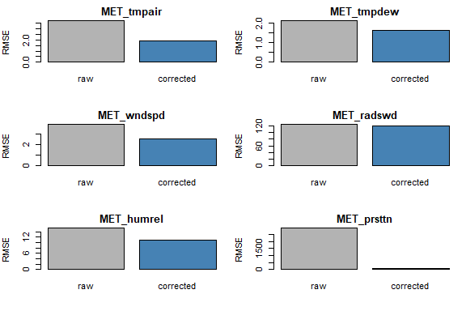
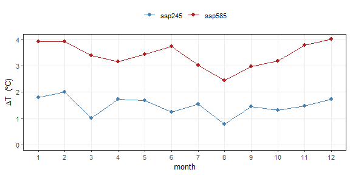
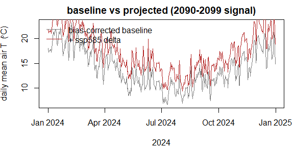
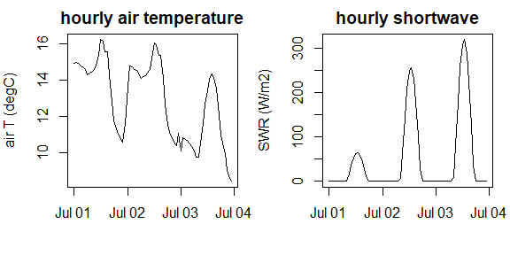

# Climate-scenario meteorology workflow

Driving a sub-daily lake model under a climate scenario needs three
things done in the right order:

1.  **bias-correct** the reanalysis against local observations,
2.  apply the climate model’s **delta-change** signal to the *corrected*
    baseline (never to the raw reanalysis, and never to the delta
    itself),
3.  **temporally disaggregate** the daily projection back to hourly.

`metscale` covers steps 1 and 3 directly; step 2 is a few lines of
arithmetic shown below. See
[`?scenario_workflow`](http://limnotrack.com/metscale/reference/scenario_workflow.md)
for why the correction must come before the delta.

``` r

library(metscale)

ex   <- system.file("extdata", package = "metscale")
TZ   <- "Etc/GMT-12"          # fixed NZST (UTC+12)
LON  <- 176.2717
LAT  <- -38.0790
ELEV <- 279                   # Lake Rotorua surface, m
```

The bundled example data is a deliberately small slice: a three-year
hourly ERA5-Land extract for Lake Rotorua (2023–2025, chosen to overlap
the buoy record), the matching buoy meteorology, and the NIWA CCAM
downscaling of one CMIP6 model (`NorESM2-MM`) cropped to a 3×3 grid
window and to 2005–2014 (historical) plus 2090–2099 (`ssp245`,
`ssp585`). A production run would use a multi-decade reanalysis record
and 20-year climate windows; the steps are identical.

## 1. Bias-correct hourly ERA5 against the buoy

The buoy anemometer sits at 2 m; `wind_height = 2` rescales it to the 10
m convention (neutral log profile) so it is comparable with ERA5 before
the bias correction is fitted.

``` r

obs <- prepare_obs_met(file.path(ex, "rotorua_buoy_met_aeme_hr.csv.gz"),
                       resample = "hour", tz = TZ, station = "rotorua_buoy",
                       wind_height = 2, verbose = FALSE)

era5 <- read.csv(file.path(ex, "rotorua_era5_hourly_met.csv.gz"),
                 check.names = FALSE)
era5$Date <- as.POSIXct(era5$Date, tz = TZ, format = "%Y-%m-%d %H:%M:%S")
attr(era5, "tz") <- TZ; attr(era5, "lat") <- LAT; attr(era5, "lon") <- LON

## "scale" (per-month offset, day-of-year loess-smoothed) is the right choice
## for a baseline that will be projected: a fitted CDF (eqm/qdm) extrapolates
## poorly outside its training range. Rainfall is left uncorrected here --- a
## lake buoy under-catches rain, so its totals are not a good target; ERA5's
## own precipitation is carried through.
fit_vars <- c("MET_tmpair", "MET_tmpdew", "MET_wndspd", "MET_radswd",
              "MET_humrel", "MET_prsttn")
bc <- fit_met_bias_correction(era5, obs, vars = fit_vars, method = "scale",
                              by = "doy-loess", verbose = FALSE)
bc$skill[bc$skill$stage %in% c("cv_raw", "cv_corrected"), ]
#>      variable        stage     n       bias       mae      rmse      r    kge
#> 3  MET_tmpair       cv_raw 13040    -3.2312    3.3591    3.7952 0.9274 0.6636
#> 4  MET_tmpair cv_corrected 13040     0.0726    1.5546    1.9684 0.9203 0.7845
#> 7  MET_tmpdew       cv_raw 12877    -1.3088    1.6958    2.1225 0.9204 0.8381
#> 8  MET_tmpdew cv_corrected 12877     0.0279    1.2088    1.6592 0.9245 0.9216
#> 11 MET_wndspd       cv_raw 13030    -3.2290    3.3061    3.9336 0.5865 0.0740
#> 12 MET_wndspd cv_corrected 13030     0.0348    2.0311    2.5646 0.5903 0.5832
#> 15 MET_radswd       cv_raw 11221    11.2662   72.3798  124.0187 0.8788 0.8652
#> 16 MET_radswd cv_corrected 11221    -4.2007   68.9717  118.1909 0.8851 0.8769
#> 19 MET_humrel       cv_raw 12877    10.6182   13.3239   15.5025 0.7248 0.4139
#> 20 MET_humrel cv_corrected 12877    -0.2193    8.8087   11.2990 0.7066 0.4532
#> 23 MET_prsttn       cv_raw 13040 -2968.9928 2968.9928 2969.8660 0.9962 0.9659
#> 24 MET_prsttn cv_corrected 13040    -3.3971   52.5505   68.4245 0.9965 0.9885
```

``` r

plot(bc)
```



plot of chunk bias-plot

Apply the fit to the whole record and expand the dependent variables —
this corrected hourly series is also the donor for disaggregation in
step 3.

``` r

era5_corr <- apply_met_bias_correction(era5, bc, expand = TRUE,
                                       lat = LAT, lon = LON, elev = ELEV,
                                       tz = TZ, verbose = FALSE)
```

One winter week, buoy against ERA5 before and after correction. The
scale correction lifts the persistently cold ERA5 air temperature onto
the buoy, scales up the under-forecast wind, and pulls down the humid
bias.

``` r

w0 <- as.POSIXct("2024-07-08", tz = TZ)
w1 <- as.POSIXct("2024-07-15", tz = TZ)
win <- function(d) d[d$Date >= w0 & d$Date < w1, ]
ob <- win(obs); rw <- win(era5); cr <- win(era5_corr)

vs  <- c(MET_tmpair = "air temperature (degC)",
         MET_wndspd = "wind speed (m/s)",
         MET_humrel = "relative humidity (%)")
op <- par(mfrow = c(3, 1), mar = c(2.5, 4.2, 1.5, 1))
for (v in names(vs)) {
  yl <- range(c(ob[[v]], rw[[v]], cr[[v]]), na.rm = TRUE)
  plot(ob$Date, ob[[v]], type = "l", lwd = 2, ylim = yl,
       xlab = "", ylab = vs[[v]])
  lines(rw$Date, rw[[v]], col = "grey60")
  lines(cr$Date, cr[[v]], col = "firebrick")
  if (v == names(vs)[1])
    legend("topright", c("buoy", "raw ERA5", "bias-corrected"),
           col = c("black", "grey60", "firebrick"), lwd = c(2, 1, 1), bty = "n")
}
```


plot of chunk correction-week

``` r

par(op)
```

## 2. Bias-corrected daily baseline

``` r

baseline <- bias_correct_daily_baseline(era5, bc, lat = LAT, lon = LON,
                                        elev = ELEV, tz = TZ, verbose = FALSE)

## keep only fully-populated days
ok <- stats::complete.cases(baseline[c("MET_radswd", "MET_tmpair", "MET_pprain",
                                       "MET_wndspd", "MET_humrel")])
baseline <- baseline[ok, ]
range(baseline$Date)
#> [1] "2023-12-01" "2025-09-01"
```

## 3. CMIP6 delta-change on the corrected baseline

Read the model series at the lake with
[`extract_cmip6_point()`](http://limnotrack.com/metscale/reference/extract_cmip6_point.md)
— it decodes the 365-day model calendar, samples bilinearly, and returns
AEME `MET_*` names and units.

``` r

cmip <- extract_cmip6_point(file.path(ex, "rotorua_cmip6"),
                            lon = LON, lat = LAT,
                            vars = c("MET_tmpair", "MET_pprain", "MET_wndspd",
                                     "MET_radswd", "MET_humrel"),
                            verbose = FALSE)
cmip_by <- split(cmip, cmip$experiment)
vapply(cmip_by, nrow, integer(1))
#> historical     ssp245     ssp585 
#>       3650       3650       3650
```

Change factors are formed per calendar month, future window vs model
historical: **additive** for temperature and shortwave (degC, W m⁻²),
**multiplicative** for the bounded/skewed fields (rainfall, wind,
humidity).

``` r

REF_YEARS <- 2005:2014
FUT_YEARS <- 2090:2099
KIND <- c(MET_tmpair = "add",   MET_radswd = "add",
          MET_pprain = "ratio", MET_wndspd = "ratio", MET_humrel = "ratio")

monthly_delta <- function(fut, hist) {
  mh <- as.integer(format(hist$Date, "%m")); hy <- as.integer(format(hist$Date, "%Y"))
  mf <- as.integer(format(fut$Date,  "%m")); fy <- as.integer(format(fut$Date,  "%Y"))
  kh <- hy %in% REF_YEARS; kf <- fy %in% FUT_YEARS
  lapply(names(KIND), function(v) {
    a <- tapply(hist[[v]][kh], mh[kh], mean, na.rm = TRUE)
    b <- tapply(fut[[v]][kf],  mf[kf], mean, na.rm = TRUE)
    d <- if (KIND[[v]] == "ratio") b / a else b - a
    stats::setNames(as.numeric(d[as.character(1:12)]), 1:12)
  }) |> stats::setNames(names(KIND))
}

apply_delta <- function(base, delta) {
  mo <- as.integer(format(base$Date, "%m"))
  out <- base
  for (v in names(delta)) {
    f <- delta[[v]][mo]
    out[[v]] <- if (KIND[[v]] == "ratio") out[[v]] * f else out[[v]] + f
  }
  out$MET_humrel <- pmin(pmax(out$MET_humrel, 0), 100)
  for (v in c("MET_radswd", "MET_wndspd", "MET_pprain"))
    out[[v]][out[[v]] < 0] <- 0
  ## regenerate dependents; station pressure carries no CMIP delta
  expand_met(out[, c("Date", "MET_radswd", "MET_tmpair", "MET_pprain",
                     "MET_humrel", "MET_wndspd", "MET_prsttn")],
             lat = LAT, lon = LON, elev = ELEV, tz = TZ)
}

deltas <- list(ssp245 = monthly_delta(cmip_by$ssp245, cmip_by$historical),
               ssp585 = monthly_delta(cmip_by$ssp585, cmip_by$historical))
sapply(deltas, function(d) round(mean(d$MET_tmpair), 2))   # annual-mean warming, degC
#> ssp245 ssp585 
#>   1.47   3.40
```

``` r

op <- par(mar = c(4, 4, 2, 1))
plot(1:12, deltas$ssp585$MET_tmpair, type = "b", pch = 16, col = "firebrick",
     xlab = "month", ylab = expression(Delta * "T  (" * degree * "C)"),
     main = "2090-2099 monthly temperature change", ylim = c(0, 4))
lines(1:12, deltas$ssp245$MET_tmpair, type = "b", pch = 16, col = "steelblue")
legend("topright", c("ssp585", "ssp245"), col = c("firebrick", "steelblue"),
       pch = 16, lty = 1, bty = "n")
```



plot of chunk delta-fig

``` r

par(op)
```

``` r

proj <- lapply(deltas, apply_delta, base = baseline)
```

``` r

op <- par(mar = c(4, 4, 2, 1))
yr <- format(baseline$Date, "%Y") == "2024"
plot(baseline$Date[yr], baseline$MET_tmpair[yr], type = "l", col = "grey50",
     xlab = "2024", ylab = expression("daily mean air T  (" * degree * "C)"),
     main = "baseline vs projected (2090-2099 signal)")
lines(proj$ssp585$Date[yr], proj$ssp585$MET_tmpair[yr], col = "firebrick")
legend("topleft", c("bias-corrected baseline", "+ ssp585 delta"),
       col = c("grey50", "firebrick"), lty = 1, bty = "n")
```



plot of chunk project-fig

``` r

par(op)
```

## 4. Disaggregate the projection to hourly

[`disaggregate_met_to_hourly()`](http://limnotrack.com/metscale/reference/disaggregate_met_to_hourly.md)
borrows the within-day shape of the corrected ERA5 record (method of
fragments) and rebuilds shortwave from solar geometry. Daily means and
rainfall totals are conserved.

``` r

slice  <- proj$ssp585[format(proj$ssp585$Date, "%Y-%m") == "2024-07", ]
hourly <- disaggregate_met_to_hourly(slice, donor = era5_corr,
                                     method = "fragments", swr = "clearsky",
                                     lat = LAT, lon = LON, elev = ELEV, tz = TZ,
                                     seed = 42, expand = TRUE, verbose = FALSE)
nrow(hourly)
#> [1] 744
```

``` r

op <- par(mar = c(4, 4, 2, 1), mfrow = c(1, 2))
d3 <- hourly[format(hourly$Date, "%Y-%m-%d") <= "2024-07-03", ]
plot(d3$Date, d3$MET_tmpair, type = "l", xlab = "", ylab = "air T (degC)",
     main = "hourly air temperature")
plot(d3$Date, d3$MET_radswd, type = "l", xlab = "", ylab = "SWR (W/m2)",
     main = "hourly shortwave")
```



plot of chunk disagg-fig

``` r

par(op)
```

The projected **daily** series (grey step) and the **hourly** series it
is disaggregated into (colour), one week of the `ssp585` 2090–2099
projection. Air temperature and wind speed vary about their daily mean;
rainfall is redistributed within the day but each day’s total is
unchanged (printed).

``` r

## pick the wettest 7-day window of the month so the rain panel is not empty
roll7 <- sapply(seq_len(nrow(slice) - 6),
                function(i) sum(slice$MET_pprain[i:(i + 6)]))
w0d <- slice$Date[which.max(roll7)]
h7  <- hourly[as.Date(hourly$Date) >= w0d & as.Date(hourly$Date) < w0d + 7, ]
day_of <- function(v) slice[[v]][match(as.Date(h7$Date), as.Date(slice$Date))]

op <- par(mfrow = c(3, 1), mar = c(2.5, 4.2, 1.5, 1))

plot(h7$Date, h7$MET_tmpair, type = "l", col = "firebrick",
     xlab = "", ylab = "air temperature (degC)")
lines(h7$Date, day_of("MET_tmpair"), type = "s", col = "grey45", lwd = 2)
legend("topright", c("daily projection", "hourly"),
       col = c("grey45", "firebrick"), lwd = c(2, 1), bty = "n")

plot(h7$Date, h7$MET_wndspd, type = "l", col = "steelblue",
     xlab = "", ylab = "wind speed (m/s)")
lines(h7$Date, day_of("MET_wndspd"), type = "s", col = "grey45", lwd = 2)

plot(h7$Date, h7$MET_pprain, type = "h", col = "seagreen",
     xlab = "", ylab = "rainfall (mm/hour)")
dd  <- unique(as.Date(h7$Date))
tot <- slice$MET_pprain[match(dd, as.Date(slice$Date))]
wet <- which(tot > 0.05)
text(as.POSIXct(paste(dd[wet], "12:00:00"), tz = TZ),
     rep(par("usr")[4] * 0.92, length(wet)),
     sprintf("%.1f mm/day", tot[wet]), col = "grey45", cex = 0.8)
```


plot of chunk daily-hourly-fig

``` r

par(op)
```

Conservation check — the hourly series re-aggregated to daily reproduces
the projected daily input:

``` r

back <- met_to_daily(hourly, tz = TZ, min_frac = 1)
m <- match(as.Date(back$Date), as.Date(slice$Date))
data.frame(
  variable = c("MET_tmpair", "MET_humrel", "MET_pprain"),
  max_abs_daily_error = sapply(c("MET_tmpair", "MET_humrel", "MET_pprain"),
                               function(v) max(abs(back[[v]] - slice[[v]][m])))
)
#>              variable max_abs_daily_error
#> MET_tmpair MET_tmpair        0.0004166667
#> MET_humrel MET_humrel        0.0004166667
#> MET_pprain MET_pprain        0.0030000000
```

## Caveats

Both the local correction and the delta-change assume **stationarity** —
a transfer function fitted on a few years of observations is asserted to
hold under a future climate. Use a long reanalysis record and 20-year
climate windows, prefer `method = "scale"` over quantile mapping for the
projected baseline, and treat the scenario spread (here `ssp245` vs
`ssp585`) as the lower bound on uncertainty. See
[`?scenario_workflow`](http://limnotrack.com/metscale/reference/scenario_workflow.md).
